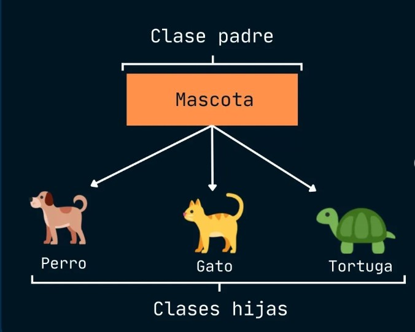

# (POO) Programación Orientada a Objetos

```{r message=FALSE, warning=FALSE, collapse=TRUE, include=FALSE}
library(sloop)
library(R6)
```


## Introducción

En primer lugar debemos tener en mente que la POO en R presenta ciertos desafíos en comparación con otros lenguajes esto debido a :

- La presencia de más de un  sistema de OOP para elegir. Dentro de los más importantes tenemos : S3, R6 y S4. Donde S3 y S4 vienen en R base y R6 en el paquete con la misma denominación 

- Dentro de la comunidad existe discrepancia sobre la importancia  de los sistemas POO mencionados , pues algunos  consideran que el orden de importancia es S3,R6 y S4 pero por otro lado otros consideran que S3 se debe evitar.

- La sintaxis utilizada para  la implementación de la POO en R en comparación con otros lenguajes populares es diferente.

Aunque  la programación funcional es más utilizada en R que la POO, es importante comprender estos sistemas por las siguientes razones :

- S3  permite que las funciones devuelvan resultados con una visualización amigable y una estructura interna agradable para el programador. S3 se utiliza en todo R base, por lo que es importante dominarlo si se desea modeificar las funciones de R base para trabajar con nuevos tipos de entrada.

- R6  proporciona una forma de escapar de la semántica copy-on-modify de R. Esto es especialmente importante si se desea modelar objetos que existen independientemente de R. Hoy en día, una necesidad común de R6 es modelar datos que provienen de una API web, y donde los cambios provienen de dentro o fuera de R.

- S4 es un sistema riguroso que obliga a pensar detenidamente en el diseño de los programas. Es adecuado para la construcción de grandes sistemas que evolucionan con el tiempo y recibirán contribuciones de muchos programadores.

En resumen  la programación orientada a objetos (POO) en R presenta  sus desafíos únicos debido a la presencia de múltiples sistemas  y desacuerdos sobre su importancia relativa donde también es fundamental tener idea de  sus aplicaciones y razones para aprender cada uno, aunque su uso efectivo puede ser complejo y requiere un tratamiento más detallado.

## Sistemas de programación orientada a objetos

La principal razón para utilizar la POO es el polimorfismo. El polimorfismo significa que un programador puede considerar la interfaz de una función separadamente de su implementación, lo cual hace posible usar la misma forma de función para diferentes tipos de entrada.Esto está estrechamente relacionado con la idea de encapsulación: el usuario no necesita preocuparse por los detalles de un objeto porque están encapsulados tras una interfaz estándar.

Para ejemplificar esta idea, el polimorfismo es lo que permite a summary() producir diferentes salidas para diferentes entradas:

```{r, collapse=TRUE}
#Utilizamos el dataframe diamonds
diamonds <- ggplot2::diamonds
#carat: variable cuantitativa
summary(diamonds$carat)
#cut: Variable cualitativa
summary(diamonds$cut)

```
Esto no implica que  summary() contenga una serie if-else para cada caso.

Los sistemas de  POO llaman clase a lo que define que es un objeto y  los métodos describen lo que ese objeto puede hacer. La clase define los campos, los datos que posee cada instancia de esa clase. Las clases se organizan en una jerarquía de forma que si un método no existe para una clase, se utiliza el método de su padre, y se dice que el hijo hereda el comportamiento. Por ejemplo, en R, un factor ordenado hereda de un factor regular, y un modelo lineal generalizado hereda de un modelo lineal. El proceso de encontrar el método correcto dada una clase se denomina despacho del método.


<center>



</center>


### Paradigmas

Existen dos paradigmas principales de POO :  encapsulado y funcional:

En la **POO encapsulada**, los métodos pertenecen a objetos o clases, y las llamadas a métodos suelen tener el aspecto de object.method(arg1, arg2). Se denomina encapsulada porque el objeto encapsula tanto los datos (con campos) como el comportamiento (con métodos), y es el paradigma que se encuentra en los lenguajes más populares.

En la **POO funcional**, los métodos pertenecen a funciones genéricas, y las llamadas a métodos parecen llamadas a funciones ordinarias: generic(object, arg2, arg3). Esto se llama funcional porque desde fuera parece una llamada a una función normal, e internamente los componentes también son funciones.


### Especificaciones de los principales sistemas POO en R


Sistemas OOP del R base: S3, S4 y RC :

**S3** es el primer sistema POO de R, el cual  es una implementación informal de POO funcional y se basa en convenciones comunes en lugar de garantías férreas. Esto hace que sea fácil empezar a trabajar con él, proporcionando una forma de óptima de resolver muchos problemas sencillos.

**S4** es una reescritura formal y rigurosa de S3, esta requiere más trabajo inicial que S3, pero a cambio proporciona más garantías y una mayor encapsulación. S4 se implementa en el paquete de métodos base, que siempre se instala con R.

**RC** implementa POO encapsulada. Los objetos RC son un tipo especial de objetos S4 que también son mutables, es decir, en lugar de utilizar la semántica habitual de R de copy-on-modify, pueden modificarse en el lugar. Esto los hace más difíciles de razonar, pero les permite solucionar problemas que son difíciles de resolver en el estilo funcional POO de S3 y S4.

El sistema POO  proporcionado por paquete CRAN de nuestro interes es:

**R6** implementa POO encapsulada como RC, pero resuelve algunos problemas importantes.Mas adelante se aprenderá  a detalle sobre el uso R6 .

## Tipos de bases

Para tratar el tema  de objetos y POO en R, en primer lugar se tiene que aclarar la confusión entre los  usos de la palabra "objeto".Por lo general se piensa que  "Todo lo que existe en R es un objeto", sin embargo, aunque todo es un objeto, no todo está orientado a objetos. Esta confusión surge porque los objetos base proceden de S, y se desarrollaron antes de que nadie pensara que S podría necesitar un sistema POO.

Los términos que se usan para diferenciar los dos tipos de objeto son: **objetos base y objetos OO para distinguirlos.**

### Objetos Base vs Objetos OO

Para diferenciar entre un objeto base y uno OO, se utiliza is.object() o sloop::otype()

```{r, collapse=TRUE}

#EJEMPLO 1
# UN OBJETO BASE:
is.object(1:10)

sloop::otype(1:10)

# Utilizamos el dataframe mtcars

# UN OBJETO OO

is.object(mtcars)

sloop::otype(mtcars)


```
Para diferenciarlos también se puede tomar en cuenta que solo los objetos OO tienen el atributo "**class**"

```{r, collapse=TRUE}
#Objeto base
attr(1:10, "class")


#Objeto OO
attr(mtcars, "class")

```

por otro lado cada objeto tiene un **base type**:


```{r, collapse=TRUE}
#Objeto Base
typeof(1:10)


#Objeto OO
typeof(mtcars)

```
En total, hay 25 tipos de bases **base type** diferentes.Estos tipos son más importantes en código C, por lo que a menudo se verán llamados por sus nombres de tipo C (estos se encuentran en paréntesis). Los presentamos a continuación


**Para vectores** tenemos los tipos :

| Tipo              | Descripción                     |
|---------------    |---------------------------------|
| NULL (NILSXP)     | Tipo nulo                       |
| logical (LGLSXP)  | Tipo lógico                     |
| integer (INTSXP)  | Tipo entero                     |
| double (REALSXP)  | Tipo decimal de precisión doble |
| complex (CPLXSXP) | Tipo complejo                   |
| character (STRSXP)| Tipo caracter                   |
| list (VECSXP)     | Tipo lista                      |
| raw (RAWSXP)      | Tipo de datos binarios          |


```{r, collapse=TRUE}
#EJEMPLOS

#NULL
typeof(NULL)


#integer
typeof(1L)


#COMPLEX
typeof(1i)

```

**Para funciones** :

| Tipo                | Descripción                         |
|-------------------- |-------------------------------------|
| closure (CLOSXP)    | Funciones regulares de R            |
| special (SPECIALSXP)| Funciones internas de R             |
| builtin (BUILTINSXP)| Funciones primitivas de R           |


```{r, collapse=TRUE}
#Ejemplos

typeof(mean) #closure

typeof(`[`) #special

typeof(sum) #builtin

```
**Para Entornos :**  environment (ENVSXP).

```{r, collapse=TRUE}
#Ejemplos
typeof(globalenv())
```

**Para Componentes de Lenguaje :** incluyen 

| Tipo                  | Información extra                                 |
|-----------------------|---------------------------------------------------|
| symbol (SYMSXP)       | Conocido como:name                                |
| language (LANGSXP)    | Conodido como: calls                              |
| pairlist (LISTSXP)    | Utilizado para los argumentos de funciones        |


```{r, collapse=TRUE}
#Ejemplos

# "symbol"
typeof(quote(a))

#"language"
typeof(quote(a + 1))

#"pairlist"
typeof(formals(mean))

```
Los tipos restantes son esotéricos y raramente vistos en R. Son importantes principalmente para el código C: externalptr (EXTPTRSXP), weakref (WEAKREFSXP), bytecode (BCODESXP), promise (PROMSXP), ... (DOTSXP), and any (ANYSXP).


Ahora hay que tener cuidado al momento de referirnos  sobre los tipos númericos : **numeric type** , pues el tipo **numeric** en R suele utilizarce para referirse a 3 cosas ligeramentes distintas :


  * En algunos lugares **numeric** se utiliza como alias del tipo double. Por ejemplo `as.numeric()` es idéntico a `as.double()`, y `numeric()` es idéntico a `double()`.

  (R también utiliza ocasionalmente real en lugar de double; `NA_real_` es el único lugar donde es probable encontrar esto en la práctica).
  
  * En los sistemas S3 y S4, numeric se utiliza como una abreviatura para el tipo integer o double, y se utiliza cuando se seleccionan métodos:


```{r, collapse=TRUE}

#EJEMPLOS

#"double" "numeric"
sloop::s3_class(1)

#"integer" "numeric"
sloop::s3_class(1L)

```

  * `is.numeric()` comprueba so  los objetos se comportan como números . Por ejemplo, los factores tienen tipo "entero" pero no se comportan como números (es decir, no tiene sentido tomar la media del factor).
```{r, collapse=TRUE}

#Factor es tipo entero 
typeof(factor("x"))


# Pero NO SE COMPORTAN COMO ENTERO 
is.numeric(factor("x"))
```


