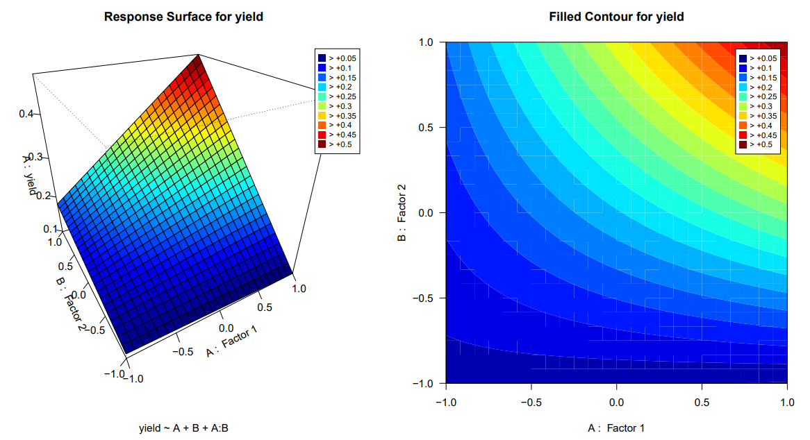
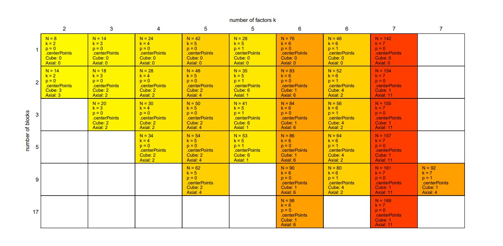

--- 
title: "Integración del Paquete QualityTools con Tidyverse"
author:
  - Miguel Flores
  - Andrea Barahona
  - Fabián Encarnación
  - Dario Quishpe
date: "`r Sys.Date()`"
site: bookdown::bookdown_site
output: bookdown::gitbook
documentclass: book
bibliography: [book.bib, packages.bib]
biblio-style: apalike
link-citations: yes
github-repo: rstudio/Libro_TidyQualityTools
description: ""
---

# Preámbulo

En este libro, se pretende combinar la información necesaria para entender los paquetes R6, Tidyquant y QualityTools, con la finalidad de tener toda la infomación necesaria en un solo documento.

<!--chapter:end:index.Rmd-->

# (POO) Programación Orientada a Objetos

```{r message=FALSE, warning=FALSE, collapse=TRUE, include=FALSE}
library(sloop)
library(R6)
```


## Introducción

En primer lugar debemos tener en mente que la POO en R presenta ciertos desafíos en comparación con otros lenguajes esto debido a :

- La presencia de más de un  sistema de OOP para elegir. Dentro de los más importantes tenemos : S3, R6 y S4. Donde S3 y S4 vienen en R base y R6 en el paquete con la misma denominación 

- Dentro de la comunidad existe discrepancia sobre la importancia  de los sistemas POO mencionados , pues algunos  consideran que el orden de importancia es S3,R6 y S4 pero por otro lado otros consideran que S3 se debe evitar.

- La sintaxis utilizada para  la implementación de la POO en R en comparación con otros lenguajes populares es diferente.

Aunque  la programación funcional es más utilizada en R que la POO, es importante comprender estos sistemas por las siguientes razones :

- S3  permite que las funciones devuelvan resultados con una visualización amigable y una estructura interna agradable para el programador. S3 se utiliza en todo R base, por lo que es importante dominarlo si se desea modeificar las funciones de R base para trabajar con nuevos tipos de entrada.

- R6  proporciona una forma de escapar de la semántica copy-on-modify de R. Esto es especialmente importante si se desea modelar objetos que existen independientemente de R. Hoy en día, una necesidad común de R6 es modelar datos que provienen de una API web, y donde los cambios provienen de dentro o fuera de R.

- S4 es un sistema riguroso que obliga a pensar detenidamente en el diseño de los programas. Es adecuado para la construcción de grandes sistemas que evolucionan con el tiempo y recibirán contribuciones de muchos programadores.

En resumen  la programación orientada a objetos (POO) en R presenta  sus desafíos únicos debido a la presencia de múltiples sistemas  y desacuerdos sobre su importancia relativa donde también es fundamental tener idea de  sus aplicaciones y razones para aprender cada uno, aunque su uso efectivo puede ser complejo y requiere un tratamiento más detallado.

## Sistemas de programación orientada a objetos

La principal razón para utilizar la POO es el polimorfismo. El polimorfismo significa que un programador puede considerar la interfaz de una función separadamente de su implementación, lo cual hace posible usar la misma forma de función para diferentes tipos de entrada.Esto está estrechamente relacionado con la idea de encapsulación: el usuario no necesita preocuparse por los detalles de un objeto porque están encapsulados tras una interfaz estándar.

Para ejemplificar esta idea, el polimorfismo es lo que permite a summary() producir diferentes salidas para diferentes entradas:

```{r, collapse=TRUE}
#Utilizamos el dataframe diamonds
diamonds <- ggplot2::diamonds
#carat: variable cuantitativa
summary(diamonds$carat)
#cut: Variable cualitativa
summary(diamonds$cut)

```
Esto no implica que  summary() contenga una serie if-else para cada caso.

Los sistemas de  POO llaman clase a lo que define que es un objeto y  los métodos describen lo que ese objeto puede hacer. La clase define los campos, los datos que posee cada instancia de esa clase. Las clases se organizan en una jerarquía de forma que si un método no existe para una clase, se utiliza el método de su padre, y se dice que el hijo hereda el comportamiento. Por ejemplo, en R, un factor ordenado hereda de un factor regular, y un modelo lineal generalizado hereda de un modelo lineal. El proceso de encontrar el método correcto dada una clase se denomina despacho del método.


<center>


</center>


### Paradigmas

Existen dos paradigmas principales de POO :  encapsulado y funcional:

En la **POO encapsulada**, los métodos pertenecen a objetos o clases, y las llamadas a métodos suelen tener el aspecto de object.method(arg1, arg2). Se denomina encapsulada porque el objeto encapsula tanto los datos (con campos) como el comportamiento (con métodos), y es el paradigma que se encuentra en los lenguajes más populares.

En la **POO funcional**, los métodos pertenecen a funciones genéricas, y las llamadas a métodos parecen llamadas a funciones ordinarias: generic(object, arg2, arg3). Esto se llama funcional porque desde fuera parece una llamada a una función normal, e internamente los componentes también son funciones.


### Especificaciones de los principales sistemas POO en R


Sistemas OOP del R base: S3, S4 y RC :

**S3** es el primer sistema POO de R, el cual  es una implementación informal de POO funcional y se basa en convenciones comunes en lugar de garantías férreas. Esto hace que sea fácil empezar a trabajar con él, proporcionando una forma de óptima de resolver muchos problemas sencillos.

**S4** es una reescritura formal y rigurosa de S3, esta requiere más trabajo inicial que S3, pero a cambio proporciona más garantías y una mayor encapsulación. S4 se implementa en el paquete de métodos base, que siempre se instala con R.

**RC** implementa POO encapsulada. Los objetos RC son un tipo especial de objetos S4 que también son mutables, es decir, en lugar de utilizar la semántica habitual de R de copy-on-modify, pueden modificarse en el lugar. Esto los hace más difíciles de razonar, pero les permite solucionar problemas que son difíciles de resolver en el estilo funcional POO de S3 y S4.

El sistema POO  proporcionado por paquete CRAN de nuestro interes es:

**R6** implementa POO encapsulada como RC, pero resuelve algunos problemas importantes.Mas adelante se aprenderá  a detalle sobre el uso R6 .

## Tipos de bases

Para tratar el tema  de objetos y POO en R, en primer lugar se tiene que aclarar la confusión entre los  usos de la palabra "objeto".Por lo general se piensa que  "Todo lo que existe en R es un objeto", sin embargo, aunque todo es un objeto, no todo está orientado a objetos. Esta confusión surge porque los objetos base proceden de S, y se desarrollaron antes de que nadie pensara que S podría necesitar un sistema POO.

Los términos que se usan para diferenciar los dos tipos de objeto son: **objetos base y objetos OO para distinguirlos.**

### Objetos Base vs Objetos OO

Para diferenciar entre un objeto base y uno OO, se utiliza is.object() o sloop::otype()

```{r, collapse=TRUE}

#EJEMPLO 1
# UN OBJETO BASE:
is.object(1:10)

sloop::otype(1:10)

# Utilizamos el dataframe mtcars

# UN OBJETO OO

is.object(mtcars)

sloop::otype(mtcars)


```
Para diferenciarlos también se puede tomar en cuenta que solo los objetos OO tienen el atributo "**class**"

```{r, collapse=TRUE}
#Objeto base
attr(1:10, "class")


#Objeto OO
attr(mtcars, "class")

```

por otro lado cada objeto tiene un **base type**:


```{r, collapse=TRUE}
#Objeto Base
typeof(1:10)


#Objeto OO
typeof(mtcars)

```
En total, hay 25 tipos de bases **base type** diferentes.Estos tipos son más importantes en código C, por lo que a menudo se verán llamados por sus nombres de tipo C (estos se encuentran en paréntesis). Los presentamos a continuación


**Para vectores** tenemos los tipos :

| Tipo              | Descripción                     |
|---------------    |---------------------------------|
| NULL (NILSXP)     | Tipo nulo                       |
| logical (LGLSXP)  | Tipo lógico                     |
| integer (INTSXP)  | Tipo entero                     |
| double (REALSXP)  | Tipo decimal de precisión doble |
| complex (CPLXSXP) | Tipo complejo                   |
| character (STRSXP)| Tipo caracter                   |
| list (VECSXP)     | Tipo lista                      |
| raw (RAWSXP)      | Tipo de datos binarios          |


```{r, collapse=TRUE}
#EJEMPLOS

#NULL
typeof(NULL)


#integer
typeof(1L)


#COMPLEX
typeof(1i)

```

**Para funciones** :

| Tipo                | Descripción                         |
|-------------------- |-------------------------------------|
| closure (CLOSXP)    | Funciones regulares de R            |
| special (SPECIALSXP)| Funciones internas de R             |
| builtin (BUILTINSXP)| Funciones primitivas de R           |


```{r, collapse=TRUE}
#Ejemplos

typeof(mean) #closure

typeof(`[`) #special

typeof(sum) #builtin

```
**Para Entornos :**  environment (ENVSXP).

```{r, collapse=TRUE}
#Ejemplos
typeof(globalenv())
```

**Para Componentes de Lenguaje :** incluyen 

| Tipo                  | Información extra                                 |
|-----------------------|---------------------------------------------------|
| symbol (SYMSXP)       | Conocido como:name                                |
| language (LANGSXP)    | Conodido como: calls                              |
| pairlist (LISTSXP)    | Utilizado para los argumentos de funciones        |


```{r, collapse=TRUE}
#Ejemplos

# "symbol"
typeof(quote(a))

#"language"
typeof(quote(a + 1))

#"pairlist"
typeof(formals(mean))

```
Los tipos restantes son esotéricos y raramente vistos en R. Son importantes principalmente para el código C: externalptr (EXTPTRSXP), weakref (WEAKREFSXP), bytecode (BCODESXP), promise (PROMSXP), ... (DOTSXP), and any (ANYSXP).


Ahora hay que tener cuidado al momento de referirnos  sobre los tipos númericos : **numeric type** , pues el tipo **numeric** en R suele utilizarce para referirse a 3 cosas ligeramentes distintas :


  * En algunos lugares **numeric** se utiliza como alias del tipo double. Por ejemplo `as.numeric()` es idéntico a `as.double()`, y `numeric()` es idéntico a `double()`.

  (R también utiliza ocasionalmente real en lugar de double; `NA_real_` es el único lugar donde es probable encontrar esto en la práctica).
  
  * En los sistemas S3 y S4, numeric se utiliza como una abreviatura para el tipo integer o double, y se utiliza cuando se seleccionan métodos:


```{r, collapse=TRUE}

#EJEMPLOS

#"double" "numeric"
sloop::s3_class(1)

#"integer" "numeric"
sloop::s3_class(1L)

```

  * `is.numeric()` comprueba so  los objetos se comportan como números . Por ejemplo, los factores tienen tipo "entero" pero no se comportan como números (es decir, no tiene sentido tomar la media del factor).
```{r, collapse=TRUE}

#Factor es tipo entero 
typeof(factor("x"))


# Pero NO SE COMPORTAN COMO ENTERO 
is.numeric(factor("x"))
```


<!--chapter:end:01-POO.Rmd-->


# R6
<div></div>

El sistema POO R6  se lo puede empezar analizando mediante sus dos propiedades especiales :

-Utiliza el paradigma de POO encapsulada, lo que significa que los métodos pertenecen a los objetos, no a los genéricos, y se se los puede llamar mediante `object$method()`.

-Los objetos R6 son mutables, lo que significa que se modifican en el lugar, y por lo tanto tienen semántica de referencia.

Si se tiene conocimientos de  POO en otros lenguajes  es probable que R6 resulte muy natural y sea una buena alternativa  a S3.


Los temas a tratar en referencia a R6 son los siguiente :

  * Clases y métodos : `R6::R6Class()` la única función que necesitas conocer para crear clases R6. Aprenderás sobre el método constructor, $new(), que te permite crear objetos R6, así como otros métodos importantes como $initialize() y $print().

  * Controles de acceso: mecanismos de acceso de R6 , campos privados y activos. Juntos, permiten ocultar datos al usuario, o exponer datos privados para su lectura pero no para su escritura.

  * Semántica de referencia : explora las consecuencias de la semántica de referencia de R6. Se aprende  el uso de finalizadores para limpiar automáticamente cualquier operación realizada en el inicializador, y un problema común si usas un objeto R6 como campo en otro objeto R6.

  * Por qué  R6 en lugar del sistema RC base?


**Requisito : **

```{r}
#install.packages("R6")
library(R6)
```


## Clases y métodos


Para crear las clases y sus métodos se utiliza: `R6::R6Class()`

Por ejemplo:

```{r collapse=TRUE}
SumaAcum <- R6Class("SumaAcum",list(
  suma = 0,
  sumar = function(x=1){
   self$suma<-self$suma+x
   invisible(self)
  }
))
```

En el ejemplo se muestra los argumentos que deben ir en la función `R6Class()`:

* El primer argumento es el nombre de la clase, el cual no es necesario, pero evita errores.

* El segundo argumento son los métodos (funciones) y campos (variables) públicos del objeto. Los métodos pueden acceder a los métodos y campos del mismo objeto mediante `self`

Para crear un nuevo objeto se utiliza el método `$new()`:

```{r collapse=TRUE}
x <- SumaAcum$new()
x
```

Además, se accede a los campos y se llama a los métodos mediante `$`:

```{r collapse=TRUE}
x$sumar(2)
x$suma
x$sumar(4)
x$suma
x$sumar()
x$suma
```

Vemos también que se utiliza `self$` para acceder a los miembros y métodos públicos de la clase (se puede usar `private$` o `super$` para miembros privados o que heredan que se verá más adelante) 

### Encadenamiento de métodos

Debido a como se crean los métodos podemos realizar un encadenamiento, por ejemplo:

```{r collapse=TRUE}
y <- SumaAcum$new()
y$sumar(5)$sumar(10)
y$suma
```
Este encadenamiento está relacionados con los **pipe** y se revisará más adelante los pros y contras de esto.

### Métodos importantes

El método `$initialize()` modifica el comportamiento de `$new()`, por ejemplo:

```{r collapse=TRUE}
Persona <- R6Class("Persona",list(
  nombre = NULL,
  edad = NA,
  initialize = function(nombre, edad= NA){
    stopifnot(is.character(nombre), length(nombre)==1)
    stopifnot(is.numeric(edad), length(edad)==1)
    self$nombre <- nombre
    self$edad <- edad
  }
))
```
De esta forma se asegura que el nombre sea un solo string y que la edad sea un solo número. Creemos por ejemplo:

```{r collapse=TRUE, error=TRUE}
Andrea <- Persona$new("Andrea", 'veintidos')
```

Por lo tanto no se crea, debido a que `'veintidos'` no es un número, y si se creará cuando lo creemos de esta forma:

```{r collapse=TRUE}
Andrea <- Persona$new("Andrea", 22)
```

En caso de tener requisitos más complejos se puede utilizar `$validate()`

El método `$print()` permite modificar el comportamiento de la impresión por defecto, por ejemplo:


```{r collapse=TRUE}
Persona <- R6Class("Persona", list(
  nombre = NULL,
  edad = NA,
  initialize = function(nombre, edad = NA) {
    self$nombre <- nombre
    self$edad <- edad
  },
  print = function(...) {
    cat("Persona: \n")
    cat("Nombre: ", self$nombre, "\n", sep = "")
    cat("Edad:  ", self$edad, "\n", sep = "")
    invisible(self)
  }
))

Andrea2 <- Persona$new("Andrea")
Andrea2
```
Ahora vemos que el objeto creado anteriormente no tiene relación con este nuevo, pues cada método está vinculado a un objeto individual. Vemos que:

```{r collapse=TRUE}
Andrea
Andrea2
```

No imprimen lo mismo.

### Agregar métodos después de la creación

Para evitar crear nuevas clases, se puede modificar los campos o métodos de una ya existente. Se utiliza `$set()` para agregar nuevos elementos. Por ejemplo:

```{r collapse=TRUE}
SumAcum <- R6Class("SumAcum")
SumAcum$set("public", "suma", 0)
SumAcum$set("public", "sumar", function(x=1){
  self$suma <- self$suma + x
  invisible(self)
})

```

Para agregarlos debemos proporcionar: visibilidad (public, entre otros), nombre y lo que se va a agregrar.

De esta forma se crea este objeto igual al que se creó en la primera sección. Además, si se agregan nuevo campos o métodos solo estarán disponibles para los nuevos objetos creados a partir de esto.

Para evitar aumentar métodos o campos se puede bloquear la clase mediante `lock_class=TRUE`, de la siguiente forma: 

```{r}
SumaAcum <- R6Class("SumaAcum",list(
  suma = 0,
  sumar = function(x=1){
   self$suma<-self$suma+x
   invisible(self)
  }),
  lock_class = TRUE
)
```

De esta forma si intentamos utilizar `$set()` se tendrá un error:

```{r, error=TRUE}
SumaAcum$set('public','y',0)
```

Se puede también bloquear o desbloquear la clase mediante `$lock()` y `$unlock()` respectivamente.


###Herencia

Se puede heredar los comportamientos de una clase existente a otra utilizando `inherit`, para ello veamos el ejemplo:

```{r collapse=TRUE}
SumAcumMsg <- R6Class("SumAcumMsg",
  inherit = SumAcum,
  public = list(
    sumar = function(x=1){
      cat("Sumando ", x, "\n", sep="" )
      super$sumar(x=x)
    }
  )
)
```

Al agregar `$sumar()` se cambia la implementación de la clase que hereda (Super clase) y se modifica con la que se implementa en el código. Vemos que se puede acceder al método de la Super clase mediante `super$`, y cualquier método que no se modifique utilizará los métodos de la Super Clase.

```{r collapse=TRUE}
x2 <- SumAcumMsg$new()
x2$sumar(5)$sumar(3)$suma
```

###Introspección

Para determinar la clase y todas las que hereda podemos utilizar `class()`:

```{r collapse=TRUE}
class(x2)
```

Podemos ver que métodos y campos contiene utilizando `name()`:

```{r collapse=TRUE}
names(Andrea2)
```

## Controles de Acceso

`R6Class()` tiene otros 2 argumentos que funcionan similar a `public`:

* `private` permite crear campos y métodos que solo están disponibles dentro de la clase y no fuera de ella.

* `active` permite utilizar funciones de acceso para definir campos dinámicos o activos.

### Privacidad

Con R6 es posible definir campos y metodos **privados**, es decir, que solo están disponibles dentro de la clase. Otros aspectos importantes de conocer son:

* El argumento `private` en `R6Class` se declara de la misma forma en la que se hace el argumento `public`, es decir, asigmar una lista de métodos (funciones) y campos (variables).

* Los campos y métodos definidos en `private` estarán disponible dentro de los métodos usando `private$` en lugar de `self$`.

Para poner esto en práctica, escribamos los campos `$edad` y `$nombre` como argumentos privados de la clase *Persona*.

Una vez definidos de esta forma, solo podremos establecer `$edad` y `$nombre` durante la creación del objeto, y no tendremos acceso a estos valores fuera de la clase.

```{r collapse=TRUE}
Persona <- R6Class("Persona", 
  public = list(
    initialize = function(nombre, edad = NA) {
      private$nombre <- nombre
      private$edad <- edad
    },
    print = function(...) {
      cat("Persona: \n")
      cat("  Nombre: ", private$nombre, "\n", sep = "")
      cat("  Edad:  ", private$edad, "\n", sep = "")
    }
  ),
  private = list(
    edad = NA,
    nombre = NULL
  )
)

Andrea3 <- Persona$new("Andrea")
Andrea3
Andrea3$nombre
```

Esta distinción entre campos públicos y privados es importante cuando se crea redes complejas de clases, ya que será fundamental tener claro a los campos que otros podrán acceder y cuales no.

Todo lo que sea privado se puede refactorizar más fácilmente porque sabes que los demás no dependen de estos campos. Los métodos privados tienden a ser menos importantes en R en comparación con otros lenguajes de programación porque las jerarquías de objetos en R tienden a ser más simples.

### Campos Activos

Los campos activos permiten definir componentes que funcionan como campos para los usuarios, pero están definidos como funciones, es decir, como métodos.

Los campos activos están implementados usando **enlaces activos**, que son funciones que toman un único argumento (`value`), si el argumento es `missing()`, significa que el valor se está recuperando, o de lo contrario se está modificando.

Por ejemplo, creemos un campo activo llamado `random` que nos devuelva un valor diferente cada que accedemos a el:

```{r collapse=TRUE}
Ran <- R6::R6Class("Ran", active = list(
  random = function(value) {
    if (missing(value)) {
      runif(1)  
    } else {
      stop("Can't set `$random`", call. = FALSE)
    }
  }
))
x <- Ran$new()
x$random
x$random
x$random
```

Los campos activos son usandos particularmente junto con el argumento de campos privamos, ya que esto hace posible implementar componentes similares a los campos pero con controles adicionales. Por ejemplo, podemos usar esto para crear un campo solo de lectura para `edad`, y para asegurarnos que `nombre` sea un vector de un solo caracter.

```{r collapse=TRUE, error=TRUE}
Persona <- R6Class("Person", 
  
  private = list(
    .edad = NA,
    .nombre = NULL
  ),
  
  active = list(
    edad = function(value) {
      if (missing(value)) {
        private$.edad
      } else {
        stop("`$edad` solo se puede leeer", call. = FALSE)
      }
    },
    name = function(value) {
      if (missing(value)) {
        private$.nombre
      } else {
        stopifnot(is.character(value), length(value) == 1)
        private$.nombre <- value
        self
      }
    }
  ),
  
  public = list(
    initialize = function(nombre, edad = NA) {
      private$.nombre <- nombre
      private$.edad <- edad
    }
  )
  
)

Andrea4 <- Persona$new("Andrea", edad = 22)
Andrea4$nombre
Andrea4$nombre <- 10
Andrea4$edad <- 20
```

## Semántica de referencia

Una de las grandes diferencias entre R6 y la mayoría de los demás objetos es que tienen una semántica de referencia. La principal consecuencia de la semántica de referencia es que los objetos no se copian cuando se modifican:

```{r collapse=TRUE}
y1 <- SumaAcum$new() 
y2 <- y1

y1$sumar(10)
c(y1 = y1$suma, y2 = y2$suma)
```

En cambio, si queremos copiar, necesitamos expecificarlo con el método `$clone()`:

```{r collapse=TRUE}
y1 <- SumaAcum$new() 
y2 <- y1$clone()

y1$sumar(10)
c(y1 = y1$suma, y2 = y2$suma)
```

(`$clone()` no clona recursivamente objetos R6 anidados. Si quieres eso, necesitarás usar `$clone(deep = TRUE)`.)

Hay otras tres consecuencias menos intuitivas:

* Es más difícil razonar sobre el código que utiliza objetos R6 porque es necesario comprender más contexto.

* Tiene sentido pensar en cuándo se elimina un objeto R6 y puede escribir `$finalize()` para complementar `$initialize()`.

* Si uno de los campos es un objeto R6, debe crearlo dentro de `$initialize()`, no de R6Class().

Estas están descritas con mayor detalle a continuación.

### Razonamientos

Generalmente, las semanticas de referencias hacen el código más difícil de entender. Tomemos el siguiente ejemplo sencillo:

```{r collapse=TRUE,eval=FALSE}
x <- list(a = 1)
y <- list(b = 2)

z <- f(x, y)
```

Para la gran mayoría de funciones, sabes que la línea final solo modifica `z`.

Ahora, tomemos un ejemplo similar que utiliza una clase de referencia de `Lista` imaginaria:

```{r collapse=TRUE, eval=FALSE}
x <- Lista$new(a = 1)
y <- Lista$new(b = 2)

z <- f(x, y)
```

Es mucho más difícil de entender la línea final: si `f()` llama a métodos de `x` o `y`, podría modificarlos al igual que `z`. Este es el mayor inconveniente potencial de R6 y se debe tener cuidado de evitarlo escribiendo funciones que devuelvan un valor o modifiquen sus entradas de R6, pero no ambas. 

### Finalización

La semántica de referencia, permite pensar en el momento en que un objeto R6 es finalizado o eliminado. Esto es diferente a la mayoría de los objetos en R, donde la semántica de copia al modificar significa que puede haber muchas versiones transitorias de un objeto, lo que no permite pensar en cuándo se elimina un objeto de forma lógica.

Por ejemplo, en el caso de objetos de tipo factor en R, cuando se modifican los niveles de un factor, se crea un nuevo objeto factor y el objeto original se deja para que lo recolecte el recolector de basura.

```{r collapse=TRUE}
x <- factor(c("a", "b", "c"))
levels(x) <- c("c", "b", "a")
```


Debido a que los objetos R6 no se copian al modificarlos, solo se eliminan una vez, tiene sentido pensar en el método `$finalize()` como un complemento al método `$initialize()`. Los finalizadores generalmente tienen un papel similar a `on.exit()`, limpiando cualquier recurso creado por el inicializador.

```{r collapse=TRUE}
ArchivoTemporal <- R6Class("ArchivoTemporal", list(
  ruta = NULL,
  initialize = function() {
    self$ruta <- tempfile()
  },
  finalize = function() {
    message("Cleaning up ", self$ruta)
    unlink(self$ruta)
  }
))
```


El ejemplo proporcionado muestra una clase llamada `ArchivoTemporal`, que encapsula un archivo temporal y se encarga de eliminarlo automáticamente cuando se finaliza la instancia de la clase.

El método `finalize` será ejecutado cuando el objeto sea eliminado (o más precisamente, por la primera recolección de basura después de que el objeto haya sido desligado de todos los nombres) o cuando R se cierre.

Esto significa que el finalizador puede ser llamado efectivamente en cualquier parte de tu código en R, lo que hace casi imposible razonar sobre el código del finalizador que toca estructuras de datos compartidas. Se recomienda evitar estos posibles problemas utilizando el finalizador solo para limpiar recursos privados asignados por el inicializador.

Finalmente, veamos cómo se utiliza esta clase `ArchivoTemporal` creando una instancia, luego eliminando explícitamente la instancia con `rm()`, lo que provoca que el finalizador se ejecute para limpiar el archivo temporal.

```{r collapse=TRUE}
at <- ArchivoTemporal$new()
rm(at)
```


En resumen, los objetos R6 permiten definir métodos `initialize` y `finalize`, que se ejecutan al crear y eliminar instancias de la clase respectivamente, permitiendo una gestión más controlada de los recursos y la limpieza de la memoria.

### Campos en R6

Una última consecuencia que puede surgir al utilizar semántica de referencia en R6, es particularmente cuando se usa una instancia de una clase R6 como valor predeterminado de un campo. La semántica de referencia significa que cuando asignas un objeto a otro, no se crea una copia independiente, sino que ambos hacen referencia al mismo objeto en la memoria.

Por ejemplo, creemos una clase llamada `DatabaseTemporal` que tiene un campo `archivo`, que es una instancia de la clase `ArchivoTemporal`.


Por ejemplo, dado el siguiente código, queremos crear una base de datos temporal cada vez que llamamos a DatabaseTemporal$new(), pero el código actual siempre usa la misma ruta.

```{r collapse=TRUE}
DatabaseTemporal <- R6Class("DatabaseTemporal", list(
  con = NULL,
  file = ArchivoTemporal$new(),
  initialize = function() {
    self$con <- DBI::dbConnect(RSQLite::SQLite(), ruta = file$ruta)
  },
  finalize = function() {
    DBI::dbDisconnect(self$con)
  }
))

db_a <- DatabaseTemporal$new()
db_b <- DatabaseTemporal$new()

db_a$file$ruta == db_b$file$ruta
```


(Si está familiarizado con Python, esto es muy similar al problema del "argumento predeterminado mutable").

El problema es que, cuando se usa una instancia de clase como valor predeterminado para un campo, esa instancia se comparte entre todas las instancias de la clase. Por lo tanto, cada instancia de `DatabaseTemporal` está haciendo referencia al mismo objeto `ArchivoTemporal`, en lugar de tener su propia instancia única.

Para solucionar este problema, se debe crear una nueva instancia de `ArchivoTemporal` dentro del método `initialize()`, de modo que cada instancia de `DatabaseTemporal` tenga su propia instancia única de `ArchivoTemporal`.


```{r collapse=TRUE}
DatabaseTemporal <- R6Class("DatabaseTemporal", list(
  con = NULL,
  archivo = NULL,
  initialize = function() {
    self$archivo <- ArchivoTemporal$new()
    self$con <- DBI::dbConnect(RSQLite::SQLite(),
                               ruta = file$ruta)
  },
  finalize = function() {
    DBI::dbDisconnect(self$con)
  }
))

db_a <- DatabaseTemporal$new()
db_b <- DatabaseTemporal$new()

db_a$archivo$ruta == db_b$archivo$ruta
```

Ahora, cada instancia de `DatabaseTemporal` tiene su propia instancia única de `ArchivoTemporal`, y por lo tanto, sus caminos de archivo son diferentes, como se espera. Esto garantiza que cada instancia de `DatabaseTemporal` tenga sus propios recursos independientes.

## ¿Por qué R6?

Este texto explica por qué el autor prefiere utilizar R6 en lugar de Reference Classes (RC), una sistema de programación orientada a objetos (OO) incorporado en R, debido a las siguientes razones:

1. **Simplicidad**: R6 es mucho más simple que RC. Mientras que ambos están construidos sobre entornos (*environments*), R6 utiliza el sistema S3, que es más sencillo y fácil de entender que el sistema S4 utilizado por RC.

2. **Documentación exhaustiva**: R6 cuenta con una documentación completa en línea disponible en https://r6.r-lib.org. Esta documentación proporciona recursos detallados y ejemplos para comprender y utilizar R6 de manera efectiva.

3. **Subclases entre paquetes**: R6 ofrece un mecanismo más simple para la subclases entre paquetes, que funciona automáticamente sin necesidad de que el usuario lo configure. Por el contrario, RC requiere más configuración y atención al detalle para lograr la misma funcionalidad.

4. **Separación de variables y campos**: En RC, las variables y los campos se mezclan en la misma pila de entornos, lo que puede conducir a confusión y a errores potenciales. En R6, los campos se colocan en un entorno separado, lo que hace que el código sea más explícito y menos propenso a errores.

5. **Velocidad**: R6 es mucho más rápido que RC en términos de tiempo de despacho de métodos. Aunque generalmente la velocidad de despacho de métodos no es crítica en aplicaciones del mundo real, RC es notablemente más lento, y el cambio de RC a R6 ha llevado a mejoras sustanciales de rendimiento en el paquete Shiny.

6. **Independencia de la versión de R**: RC está ligado a una versión específica de R. Esto significa que cualquier corrección de errores en RC solo se puede aprovechar si se requiere una versión más reciente de R. Esto puede dificultar la compatibilidad entre paquetes que necesitan funcionar en diferentes versiones de R.


## Ejercicios prácticos

1. Create a bank account R6 class that stores a balance and allows you to deposit and withdraw money. Create a subclass that throws an error if you attempt to go into overdraft. Create another subclass that allows you to go into overdraft, but charges you a fee.

```{r, collapse=TRUE, error=TRUE}
CuentaBanco <- R6Class("CuentaBanco",
  private = list(
    saldo = 0
  ),
  active = list(
    .saldo = function(value){
      if (missing(value)) {
        private$saldo
      } else {
        stop("`$saldo` solo se puede leer NO modificar", call. = FALSE)
      }
    }
  ),
  public = list(
    initialize = function(x=0){
      private$saldo <- x
    },
    depositar = function(x){
      private$saldo <- private$saldo + x
      invisible(self)
    },
    retirar = function(x){
      private$saldo = private$saldo - x
      invisible(self)
    },
    print = function(...){
      cat("Cuenta: \n")
      cat("  Saldo: ", private$saldo, "\n", sep = "")
    }
  )
)

SubCuentaBanco1 <- R6Class('SubCuentaBanco1',
  inherit = CuentaBanco,
  public =  list(
    retirar = function(x){
      stopifnot("Existe sobregiro"= super$.saldo-x>=0)
      private$saldo<-super$retirar(x)$.saldo
      }
  )                          
)

SubCuentaBanco2 <- R6Class('SubCuentaBanco2',
  inherit = CuentaBanco,
  public =  list(
    retirar = function(x){
      if(super$.saldo-x<0){
        private$saldo <- super$retirar(x)$.saldo - 1 #Cargo extra 1  
      }
      else{private$saldo <- super$retirar(x)$.saldo}
      }
  )                          
)

Fab <- CuentaBanco$new(100)
Fab

Fab$retirar(50)
Fab

Fab$depositar(10)
Fab

Fab2<-SubCuentaBanco1$new(100)
Fab2

Fab2$retirar(150)
Fab2

Fab3 <- SubCuentaBanco2$new(100)
Fab3

Fab3$retirar(150)
Fab3
```

2. Create an R6 class that represents a shuffled deck of cards. You should be able to draw cards from the deck with `$draw(n)`, and return all cards to the deck and reshuffle with `$reshuffle()`. Use the following code to make a vector of cards.

```{r, collapse=TRUE}
library(R6)
cartas <- R6Class('cartas',
  private = list(
    suit = c("♠", "♥", "♦", "♣"),
    val = c("A", c(2:10), "J", "Q", "K")
  ),                
  public = list(
    cards = c(paste0(rep(c("A", c(2:10), "J", "Q", "K"), 4),
                     c("♠", "♥", "♦", "♣"))),
    drawn = function(n){
      self$cards <- self$cards[-n]
      invisible(self)
    },
    reshuffle=function(){
      copy <- paste0(rep(private$val, 4), private$suit)
      x<-sample(52)
      for (i in 1:52) {
        self$cards[i]<-copy[x[i]]
      }
      invisible(self)
    }
  ),
  active=list(
    .cartas=function(value){
      if(missing(value)){
        self$cards
      }
      else{stop("`Cartas` solo se puede leer NO modificar", 
                call. = FALSE)}
    }
  )
)

mazo<-cartas$new()
mazo$.cartas
mazo$drawn(1)
mazo$.cartas
mazo$reshuffle()
mazo$.cartas
```

3. Create an R6 class that allows you to get and set the current time zone. You can access the current time zone with `Sys.timezone()` and set it with `Sys.setenv(TZ = "newtimezone")`. When setting the time zone, make sure the new time zone is in the list provided by `OlsonNames()`.

```{r, collapse=TRUE}
ZonaHoraria <- R6Class('ZonaHoraria',
  public = list(
    zona = Sys.timezone(),
  cambiar_zona=function(name){
    stopifnot("No existe esa zona horaria" = name %in% OlsonNames()) 
    self$zona=Sys.setenv(TZ = name)
  })
)
```

```{r, collapse=TRUE}
zona <- ZonaHoraria$new()
zona$cambiar_zona('America/Guayaquil')
zona
Sys.timezone()
```

4. Create an R6 class that manages the current working directory. It should have `$get()` and `$set()` methods.

```{r warning=FALSE, collapse=TRUE, error=TRUE}
Directorio <- R6Class('Directorio',
  public = list(
    get=function(){
      getwd()
    },
    set=function(path){
      setwd(path)
      invisible(self)
    }
  )
)
direct <- Directorio$new()
direct$get()
direct$set("C:/Users/Dell/OneDrive - Escuela Politécnica Nacional/Pasantías UDC")
direct$get()
```


5. Create a class with a write-only `$password` field. It should have `$check_password(password)` method that returns `TRUE` or `FALSE`, but there should be no way to view the complete password.

```{r, error=TRUE, collapse=TRUE}
# install.packages("R6")
library(R6)


Bank_writeonly <- R6Class("Bank_writeonly", 
      private = list(
            user = NULL,
            password = NULL
      ),
      active = list(
        .password = function(x){
          if(missing(x)){
            stop("`$.password` solo permite cambiar tu contraseña, NO verla",
                 call. = FALSE)
          } else{
            private$password <- x
            cat("Contraseña cambiada con éxito")
          }
        }
      ),
      public = list(
            initialize = function(.user, .password){
              private$password <- .password
              private$user <- .user
              },
            check_password = function(p){
              if(private$password == p){ 
                cat("Tu contraseña SI coincide con la ingresada", call. = FALSE)}
              else{
                stop("Tu contraseña NO coincide con la ingresada")}
              },
            print = function(...){
              cat("Bienvenido al Banco \n")
              cat("Tu cuenta se ha creado con el nombre de usuario:", private$user)
            }
      )
      
)

# Prueba

Cuenta_Andrea <- Bank_writeonly$new("AndreaBC", "prueba123")
# Print
Cuenta_Andrea
# Funcion Check_password
Cuenta_Andrea$check_password("Nomeacuerdomicontraseña")
Cuenta_Andrea$check_password("prueba123")
# .password
Cuenta_Andrea$.password
Cuenta_Andrea$.password <- "NuevaContraseña"
```


6. Extend the Rando class with another active binding that allows you to access the previous random `value.` Ensure that active binding is the only way to access the value.

```{r, collapse=TRUE}
Rando <- R6::R6Class("Rando", 
    private = list(prev = NULL),
    active = list(
      random = function(value) {
        if (missing(value)) {
          private$prev <- runif(1)
          private$prev
        } else {
          stop("Can't set `$random`", call. = FALSE)
        }
      },
      previous = function(value) {
        if (missing(value)) {
          private$prev
        } else {
          stop("Can't set `$random`", call. = FALSE)
        }
      }
    )
)
x <- Rando$new()
x$random
x$random
x$previous
```


<!--chapter:end:02-R6.Rmd-->

# TidyQuant

```{css, echo=FALSE}
.scroll-100 {
  max-height: 100px;
  overflow-y: auto;
  background-color: inherit;
}
```

Existe una amplia gama de funciones de análisis cuantitativo útiles que funcionan con objetos de series temporales. El problema es que muchas de estas maravillosas funciones no funcionan con tipos de datos `data.frame`, ni con el flujo de trabajo de `tidyverse`. 

Por ello el paquete **Tidyquant** integra las funciones más útiles de los paquetes: `xts`, `zoo`, `quantmod`, `TTR` y ``PerformanceAnalytics`, por ello, este texto se centra en demostrar como se integran las funciones más importantes con los paquetes financieros cuantitativos.siguientes:

* Transmutar `tq_transmute()`: Esta funcion devuelve un nuevo 'tidy data frame', que normalmente tiene una periodicidad diferente a la de la entrada.

* Mutate `tq_mutate()`: Esta funcion agrega columanas al tidy data frame.

Para ello, lo primero que haremos será cargar los paquetes correspondientes:

```{r, warning=FALSE, message=FALSE}
# Cargar tidyquant, lubridate, xts, quantmod, TTR 
library(tidyverse)
library(tidyquant)
```

## Compatibilidad de funciones

`tq_transmute_fun_options()` Devuelve una lista de **funciones de mutación compatibles** con cada paquete, para ello haremos una breve discusión de las opciones respecto a cada paquete.

```{r, class.output="scroll-100"}
tq_transmute_fun_options() %>% str()
```
Para ello, accederemos a las funciones de los respectivos paquetes que tienen compatibilidad para trabarse con `tq_transmute` y `tq_mutate` a partir del comando "$".

### Funcionalidad zoo

```{r, class.output="scroll-100"}
tq_transmute_fun_options()$zoo
```

Las funciones del paquete `zoo` que son compatibles se enumerar arriba. EN términos generales, estas son:

* Funciones *Roll Apply*:

  - Una función genérica para aplicar una función a los márgenes móviles.
  - Forma: `rollapply(data, width, FUN, ..., by = 1, by.column = TRUE, fill = if (na.pad) NA, na.pad = FALSE, partial = FALSE, align = c("center", "left", "right"), coredata = TRUE)`
  - Las opciones incluyen: `rollmax`, `rollmean`, `rollmedian`, `rollsum`, etc.
  
### Funcionalidad xts

```{r, class.output="scroll-100"}
tq_transmute_fun_options()$xts
```

Las funciones del paquete `xts` que son compatibles están enumeradas arribas. en términos generales, son:

* Funciones *Period Apply*:
  - Aplicar una función a un segmento de tiempo, por ejemplo: `max`, `min`, `mean`, etc.
  - Forma: `apply.daily(x, FUN, ...)`.
  - Las opciones incluyen: `apply.daily`, `weekly`, `monthly`, `quarterly`, `yearly`.

* Funciones *To-Period Functions*:
  - Convierte una serie de tiempo en un serie de tiempo de menor periodicidad, por ejemplo, convierte periodicidad diaria en mensual.
  - Forma: `to.period(x, period = 'months', k = 1, indexAt, name = NULL, OHLC = TRUE, ...)`.
  - Las opciones incluyen: `to.minutes`, `hourly`, `daily`, `weekly`, `monthly`, `quarterly`, `yearly`.
  - Es importante aclarar que: la estructura de devolución es diferente para `to.period`, `to.monthly`, `to.weekly`, `to.quarterly`, etc. `to.period` retorna la fecha, mientras que `to.monthly` devuelve un caracter de tipo "MON YYYY". Es recomendable trabajaer con `to.period`, si se desea trabar con series temporales a través de `lubridate`.
  
### Funcionalidad quantmod

```{r, class.output="scroll-100"}
tq_transmute_fun_options()$quantmod
```

Las funciones del paquete `quantmod` que son compatibles se enumeran arriba. En terminos generales, son :

* Funciones de cambio porcentual (Delt) y retrasos:
  - Delt: `Delt(x1, x2 = NULL, k = 0, type = c("arithmetic", "log"))`
    * Variaciones de Delt: ClCl, HiCl, LoCl, LoHi, OpCl, OpHi, OpLo, OpOp
    * Forma: `OpCl(OHLC)`
  - Retrasos: `Lag(x, k = 1)` / Siguiente: `Next(x, k = 1)` (También puede usar `dplyr::lag and dplyr::lead`)
  
* Funciones de devolución del período:
  - Se obtienen los rendimientos aritméticos o logarítmicos para diversas periodicidades, qué incluyen diaria, semanal, mensual, trimestral y anual.
  - Forma: `periodReturn(x, period = 'monthly', subset = NULL, type = 'arithmetic', leading = TRUE, ...)`

* Funciones de Series:
  - Devuelve valores que describen la serie, las opciones incluyen describir los aumentos o disminuciones, la aceleración o desaceleración y alto o bajo.
  - Formas: `seriesHi(x)`, `seriesIncr(x, thresh = 0, diff. = 1L)`, `seriesAccel(x)`.
  
### Funcionalidad TTR

```{r, class.output="scroll-100"}
tq_transmute_fun_options()$TTR
```

Aquí hay una breve descripción de las funciones más populares de `TTR`:

* Índice de movimiento direccional de Welles Wilder:
  - `ADX(HLC, n = 14, maType, ...)`
* Bandas de Bollinger:
  - `BBands(HLC, n = 20, maType, sd = 2, ...)`
* Tasa de cambio/impulso:
  - Tasa de cambio - `ROC(x, n = 1, type = c("continuous", "discrete"), na.pad = TRUE)`.
  - Impulso/Momento - `momentum(x, n = 1, na.pad = TRUE)`
* Medias Móviles (maType):
  - Media móvil simple - `SMA(x, n = 10, ...)`
  - Media móvil exponencial - `EMA(x, n = 10, wilder = FALSE, ratio = NULL, ...)`
  - Media móvil exponencial doble - `DEMA(x, n = 10, v = 1, wilder = FALSE, ratio = NULL)`
  - Media móvil Ponderada - `WMA(x, n = 10, wts = 1:n, ...)`
  - Media móvil elástica ponderada por volumen - `EVWMA(price, volume, n = 10, ...)`
  - Media móvil exponencial de retardo cero - `ZLEMA(x, n = 10, ratio = NULL, ...)`
  - Precio promedio móvil ponderado por volumen - `VWAP(price, volume, n = 10, ...)`
  - Media móvil de longitud variable - `VMA(x, w, ratio = 1, ...)`
  - Media móvil de Hull - `HMA(x, n = 20, ...)`
  - Média Movil de Arnaud Legoux - `ALMA(x, n = 9, offset = 0.85, sigma = 6, ...)`
* Oscilador MACD:
  - `MACD(x, nFast = 12, nSlow = 26, nSig = 9, maType, percent = TRUE, ...)`
* Índice de Fuerza Relativa:
  - `RSI(price, n = 14, maType, ...)`
* runFun:
  - `runSum(x, n = 10, cumulative = FALSE)`: devuelve sumas durante una ventana móvil de n períodos.
  - `runMin(x, n = 10, cumulative = FALSE)`: devuelve mínimos durante una ventana móvil de n períodos.
  - `runMax(x, n = 10, cumulative = FALSE)`: devuelve máximos durante una ventana móvil de n períodos.
  - `runMean(x, n = 10, cumulative = FALSE)`: devuelve medias durante una ventana móvil de n períodos.
  - `runMedian(x, n = 10, non.unique = "mean", cumulative = FALSE)`: devuelve medianas durante una ventana móvil de n períodos.
  - `runCov(x, y, n = 10, use = "all.obs", sample = TRUE, cumulative = FALSE)`: devuelve covarianzas sobre una ventana móvil de n períodos.
  - `runCor(x, y, n = 10, use = "all.obs", sample = TRUE, cumulative = FALSE)`: devuelve correlaciones durante una ventana móvil de n períodos.
  - `runVar(x, y = NULL, n = 10, sample = TRUE, cumulative = FALSE)`: devuelve variaciones durante una ventana móvil de n períodos.
  - `runSD(x, n = 10, sample = TRUE, cumulative = FALSE)`: devuelve desviaciones estándar durante una ventana móvil de n períodos.
  - `runMAD(x, n = 10, center = NULL, stat = "median", constant = 1.4826, non.unique = "mean", cumulative = FALSE)`: devuelve las desviaciones absolutas mediana/media durante una ventana móvil de n períodos.
  - `wilderSum(x, n = 10)`: devuelve una suma ponderada al estilo de Welles Wilder sobre una ventana móvil de n períodos.
* Ocilador estocástico:
  - `stoch(HLC, nFastK = 14, nFastD = 3, nSlowD = 3, maType, bounded = TRUE, smooth = 1, ...)`
* Índice de momento estocástico:
  - `SMI(HLC, n = 13, nFast = 2, nSlow = 25, nSig = 9, maType, bounded = TRUE, ...)`

### Funcionalidad PerformanceAnalytics 

```{r, class.output="scroll-100"}
tq_transmute_fun_options()$PerformanceAnalytics
```

Todas las funciones de mutación `PerformanceAnalytics` se ocupan de devoluciones:

* `Return.annualized` y `Return.annualized.excess`: toma los rendimientos del período y los consolida en rendimiento anualizados.

* `Return.clean`: elimina los valores atípicos de las devoluciones.

* `Return.excess`: elimina la tasa libre de riesgo de los rendimientos para generar rendimientos superiores a la tasa libre de riesgo.

* `zerofill`: Se utiliza para reemplazar valores `NA` con ceros.

## Poder Cuantitativo en Acción

Revisaremos algunos ejemplos, para ello utilizaremos la base de datos `FANG`, de datos que consta de los precios de las acciones de FB, AMZN, NFLX y GOOG desde principios de 2013 hasta finales del 2016.

```{r, class.output="scroll-100"}
data("FANG")
FANG
```

### Ejemplo 1: utilizar quantmod periodReturn para convertir precios en rentabilidad

La funcioón `quantmod::periodReturn()` genera retornos por periodicidad, para ello, revisemos algunos casos:

#### Ejemplo 1A: Obtener y registrar las rentabilidades anuales

Utilizamos la columna de precios de cierre ajustados (ajustada para divisiones de acciones, lo que puede hacer que parezca que una acción tiene un mal desempeño si se incluye una división).

Establecemos `select = adjusted`, investigamos la función `periodReturn` y descubrimos que acepta `type = "arithmetic"` y `period = "yearly"`, que devuelve los rendimientos anuales.

```{r, class.output="scroll-100"}
FANG_annual_returns <- FANG %>%
    group_by(symbol) %>%
    tq_transmute(select     = adjusted, 
                 mutate_fun = periodReturn, 
                 period     = "yearly", 
                 type       = "arithmetic")
FANG_annual_returns
```

Ahora, grafiquemos los redimientos anuales, a partir del uso rápido del paquete `ggplot2`:

```{r, fig.align='center'}
FANG_annual_returns %>%
    ggplot(aes(x = date, y = yearly.returns, fill = symbol)) +
    geom_col() +
    geom_hline(yintercept = 0, color = palette_light()[[1]]) +
    scale_y_continuous(labels = scales::percent) +
    labs(title = "FANG: Annual Returns",
         subtitle = "Get annual returns quickly with tq_transmute!",
         y = "Annual Returns", x = "") + 
    facet_wrap(~ symbol, ncol = 2, scales = "free_y") +
    theme_tq() + 
    scale_fill_tq()
```

#### Ejemplo 1B: Obtener devoluciones de registros diarios

Los retornos de registros diarios siguen un enfoque similar. Normalmente se usa una función de transmutación `tq_transmute` porque la función `periodReturn` acepta diferentes opciones de periodicidad, y cualquier cosa que no sea diaria hará estallar una mutación. 

Sin embargo, en nuestro ejemplo, la periodicidad de los rendimientos es la misma que la periodicidad de los precios de las accciones (ambas diarias), por lo que podemos usar cualquiera de las dos funciones mencionadas anterioremente. 

Queremos utilizar la columna de precioes de cierre ajustados, para ello configuramos de manera similar al ejemplo anterior y obtenemos lo siguiente:

```{r}
FANG_daily_log_returns <- FANG %>%
    group_by(symbol) %>%
    tq_transmute(select     = adjusted, 
                 mutate_fun = periodReturn, 
                 period     = "daily", 
                 type       = "log",
                 col_rename = "monthly.returns")
```

Y la gráfica, obtenida a partir del paquete `ggplot2`, se verá de la siguiente manera:

```{r, fig.align='center'}
FANG_daily_log_returns %>%
    ggplot(aes(x = monthly.returns, fill = symbol)) +
    geom_density(alpha = 0.5) +
    labs(title = "FANG: Charting the Daily Log Returns",
         x = "Monthly Returns", y = "Density") +
    theme_tq() +
    scale_fill_tq() + 
    facet_wrap(~ symbol, ncol = 2)
```


### Ejemplo 2: utilice xts to.period para cambiar la periodicidad de diaria a mensual

La función `xts::to.period` se utiliza para convertir la periodicidad de un nivel inferior a un nivel superior (ej: meses a años). Dado que se busca una estructura que tenga una escala de tiempo diferente a la de entrada, se debe hacer una transformación. Utilizamos `tq_transmute()`, pasamos las columnas "open", "high", "low", "close" y "volume", y usamos el periodo "months".

```{r}
FANG |>  group_by(symbol) |> tq_transmute(select = open:volume,
                                mutate_fun = to.period,
                                period = "months")
```

Podemos comparar la visualización gráfica agrupando y sin agrupas:

**Sin agregración de periodicidad**

```{r}
FANG_diario <- FANG |> group_by(symbol) 
FANG_diario |> ggplot(aes(x=date, y=adjusted, color = symbol))+
               geom_line(linewidth = 1) +
               labs(title = "Precio diario de acciones",
                    x = "", y = "Precios ajustados", color = "")+
               facet_wrap(~ symbol, ncol = 2, scales = "free_y")+
               scale_y_continuous(labels = scales::dollar)+
               theme_tq()+
               scale_color_tq()
```

**Con agregación de periodicidad mensual**

```{r}
FANG_mensual <- FANG |>  group_by(symbol) |> tq_transmute(select = adjusted,
                                mutate_fun = to.period,
                                period = "months")
FANG_mensual |> ggplot(aes(x = date, y = adjusted, color = symbol)) +
                geom_line(linewidth = 1) + labs(title = "Monthly Stock Prices", x = "", y = "Adjusted Prices", color = "") +
                facet_wrap(~ symbol, ncol = 2, scales = "free_y") + scale_y_continuous(labels = scales::dollar) +
                theme_tq() + scale_color_tq()
```
Con esto se reduce la cantidad de puntos y el gráfico de la serie temporal se suaviza.

### Ejemplo 3: utilice TTR runCor para visualizar correlaciones continuas de rendimientos

Las correlaciones de rendimiento son una forma para analizar la medida en que un activo imita un índice de referencia. Utilizaremos los datos de `FANG` como los datos y la línea de base será el sector tecnológico "XLK", para ello se recupera los precios utilizando `tq_get`, y los rendimientos se calculan a partir de los precios ajustados del Ejemplo 1

```{r}
#Rendimientos
FANG_rend_mensual <- FANG |> group_by(symbol) |> 
                     tq_transmute(select = adjusted,
                                  mutate_fun = periodReturn,
                                  period = "monthly")
#Valor base de Rendimientos de referencia
base_rend_mensual <- "XLK" |> tq_get(get = "stock.prices",
                                            from = "2013-01-01",
                                            to = "2016-12-31") |> 
                              tq_transmute(select = adjusted,
                                           mutate_fun = periodReturn,
                                           period = "monthly")

#Unir 
rends <- left_join(FANG_rend_mensual, base_rend_mensual, by="date")
rends
```

La función `runCor` se puede utilizar para evaluar correlaciones rodantes, además se puede incluir el ancho de la correlación que en este caso utilizaremos seis al estar en una escala mensual. Se utilizará `tq_transmute_xy` para realizar esto:

```{r warning=FALSE}
FANG_corr <- rends |> tq_transmute_xy(x = monthly.returns.x,
                                   y = monthly.returns.y,
                                   mutate_fun = runCor,
                                   n = 6,
                                   col_rename = "corr_6")
#Grafico
FANG_corr |> ggplot(aes(x = date, y = corr_6, color = symbol))+
             geom_hline(yintercept = 0, color = palette_light()[[1]])+
             geom_line(size = 1)+
             labs(title = "FANG: Correlación 6 meses a XLK", x="", y="Correlation",color="")+
             facet_wrap(~symbol,ncol=2)+
             theme_tq()+scale_color_tq()
```


### Ejemplo 4: utilizar TTR::MACD para visualizar la divergencia y convergencia de la media móvil

La función `MACD` nos da la convergencia y divergencia de la media móvil, vemos que la salida tiene la misma periodicidad que la entrada y las funciones funcionan con las de OHLC, por lo que se puede utilizar `tq_mutate()`

```{r}
FANG_macd <- FANG |> group_by(symbol) |> 
                     tq_mutate(select = close,
                               mutate_fun = MACD,
                               nFast = 12,
                               nSlow = 26,
                               nSig = 9,
                               maType = SMA) |> 
                     mutate(diff = macd - signal) |> 
                     select(-(open:volume))
FANG_macd
```

Y se puede graficar los datos de la siguiente forma:

```{r}
FANG_macd %>%
    filter(date >= as_date("2016-10-01")) %>%
    ggplot(aes(x = date)) + 
    geom_hline(yintercept = 0, color = palette_light()[[1]]) +
    geom_line(aes(y = macd, col = symbol)) +
    geom_line(aes(y = signal), color = "blue", linetype = 2) +
    geom_bar(aes(y = diff), stat = "identity", color = palette_light()[[1]]) +
    facet_wrap(~ symbol, ncol = 2, scale = "free_y") +
    labs(title = "FANG: Convergencia y Divergencia de la Media Móvil",
         y = "MACD", x = "", color = "") +
    theme_tq() +
    scale_color_tq()
```


### Ejemplo 5: utilizar xts::apply.quarterly para obtener el precio máximo y mínimo para cada trimestre

La función `xts::apply.quarterly()` se puede utilizar para aplicar funciones por segmentos de tiempos trimestrales. Debido a que se va a usar una escala diferente a la de entrada (diaria) se necesita la función de transmutación `tq_transmute`, en la cual se configura en el argumento `FUN= max` para obtener los precios máximos de cierre durante el trimestre y en el argumento `mutate_fun` se escribe la función a aplicar por segmentos.

```{r}
FANG_maxtrim <- FANG |> group_by(symbol) |> 
                        tq_transmute(select = adjusted,
                                     mutate_fun = apply.quarterly,
                                     FUN = max,
                                     col_rename = "max.close") |> 
                        mutate(year.qtr = paste0(year(date), "-Q", quarter(date))) |> 
                        select(-date)
FANG_maxtrim
```

y para obtener los precios mínimos se cambia el argumento `FUN = min`, además se pueden unir para obtenerlos en una misma salida:

```{r}
FANG_mintrim <- FANG |> group_by(symbol) |> 
                        tq_transmute(select = adjusted,
                                     mutate_fun = apply.quarterly,
                                     FUN = min,
                                     col_rename = "min.close") |> 
                        mutate(year.qtr = paste0(year(date), "-Q", quarter(date))) |> 
                        select(-date)
FANG_trim <- left_join(FANG_maxtrim,FANG_mintrim, by=c("symbol"="symbol","year.qtr"="year.qtr"))
FANG_trim
```

Para la visualización de los datos podemos realizar lo siguiente:

```{r}
FANG_trim |> ggplot(aes(x=year.qtr,color=symbol))+
             geom_segment(aes(xend=year.qtr,y=min.close,yend=max.close),linewidth=1)+
             geom_point(aes(y = max.close), size = 2) +
             geom_point(aes(y = min.close), size = 2) +
             facet_wrap(~ symbol, ncol = 2, scale = "free_y") +
             labs(title = "FANG: Precio máximo y mínimo por trimestre",
         y = "Precio de acción", color = "") +
             theme_tq() +
             scale_color_tq() +
             scale_y_continuous(labels = scales::dollar) +
             theme(axis.text.x = element_text(angle = 90, hjust = 1),
             axis.title.x = element_blank())
```


### Ejemplo 6: utilizar zoo::rollapply para visualizar una regresión continua

En este ejemplo se analizará la relación entre dos activos similares: Mastercard y Visa, para mostrar la relación mediante regresión. Primero se verá la tendencia de los rendimientos, para ello utilizamos `tq_get()` para obtener los precios de las acciones, y `tq_transmute()` para transformar los precios en rendimientos.

```{r message=FALSE, warning=FALSE}
precios_accion <- c("MA", "V") %>%
    tq_get(get  = "stock.prices",
           from = "2015-01-01",
           to   = "2016-12-31") %>%
    group_by(symbol) 

rend_accion <- precios_accion %>%
    tq_transmute(select     = adjusted,
                 mutate_fun = periodReturn,
                 period     = "daily",
                 type       = "log",
                 col_rename = "returns") %>%
    spread(key = symbol, value = returns)

#GRAFICOS
rend_accion %>%
    ggplot(aes(x=V,y=MA)) +
    geom_point(color = palette_light()[[1]], alpha = 0.5) +
    geom_smooth(method = "lm") +
    labs(title = "Relación de rendimiento de las acciones ") +
    theme_tq()
```

Se puede ver estadísticas de la relación a partir de la función `lm`:

```{r}
lm(MA~V,data = rend_accion) |> summary()
```

La estimación del coeficiente es 0.8134 por lo que se tiene una relación positiva, es decir que a medida que V crece, MA aumenta.

Se puede utilizar la funcion `rollapply` para realizar una regresión móvil, es decir, mostrar como el modelo varía a lo largo del tiempo. Para ello se creará una función:

```{r}
regr_fun <- function(data){
  coef(lm(MA~V,data=timetk::tk_tbl(data,silent=TRUE)))
}
```

y se utilizará `tq_mutate()` para aplicar la función de regresión creada utilizando `rollapply` de la siguiente forma:

```{r}
rend_accion <- rend_accion |> tq_mutate(mutate_fun = rollapply,
                                              width=90,
                                              FUN=regr_fun,
                                              by.column=FALSE,
                                              col_rename = c("coef.0","coef.1"))
rend_accion
```

Para visualizar el primer coeficiente, se puede agregar una linea horizontal utilizando el modelo de conjunto de datos completo, ya que así se puede ver en que momentos se desvía de la tendencia a largo plazo.

```{r warning=FALSE}
rend_accion |> ggplot(aes(x=date,y=coef.1))+
                  geom_line(size=1,color=palette_light()[[1]])+
                  geom_hline(yintercept = 0.8134, size = 1, color = palette_light()[[2]])+
                  labs(title = "MA ~ V: Visualizing Rolling Regression Coefficient", x = "")+
                  theme_tq()
```

Para visualizar la rentabilidad de las acciones durante el período de tiempo:

```{r}
precios_accion |> tq_transmute(adjusted,
                               periodReturn,
                               period="daily",
                               type="log",
                               col_name="returns") |> 
                   mutate(wealth.index = 100 * cumprod(1 + daily.returns)) %>%
                   ggplot(aes(x = date, y = wealth.index, color = symbol)) +
                   geom_line(size = 1) +
                   labs(title = "MA and V: Stock Prices") +
                   theme_tq() + 
                   scale_color_tq()
```


### Ejemplo 7: utilizar return.clean y return.excess para limpiar y calcular el exceso de rendimiento

En este ejemplo primero se calcula los rendimientos diarios utilizando `periodReturn`, luego se utiliza `Return.clean` para limpiar los valores atípico de los datos devueltos, en el que el parámetro `alpha` es el porcentaje de datos atípicos se va a limpiar. Por último, los rendimientos excedentes se calculan con la función `Return.excess` con el parámetro `Rf` que representa la tasa libre de riesgo.

```{r}
FANG %>% group_by(symbol) %>% tq_transmute(adjusted, periodReturn, period = "daily") %>%
                              tq_transmute(daily.returns, Return.clean, alpha = 0.05) %>%
                              tq_transmute(daily.returns, Return.excess, Rf = 0.03 / 252)
```


<!--chapter:end:03-Tidyquant.Rmd-->

# QualityTools

```{r message=FALSE, warning=FALSE, include=FALSE}
library(qualityTools)
```


<div></div>

Este trabajo pretende dar una breve introducción a los métodos del paquete **QualityTools**. Este paquete se implementó con fines didácticos para servir como una "Caja de Herramientas" (Six-Sigma) y contiene métodos asociados con el ciclo de resolución con la metodología de: "Definir, Medir, Analizar, Mejorar y Controlar" (con sus siglas en inglés DMAIC). 

El uso de estos métodos se ilustran con ayuda de conjuntos de datos creados artificalmente, a continuación se explica, el objetivo de cada una de las fases de este ciclo:

* **Definir**: Describir el problema y sus consecuencias (financieras), es la etapa fundamental para delimitar el problema. Los diagramas de flujo. Los diagramas de flujo de procesos identifican elementos cruciales del proceso (es decir, actividades), las técnicas de creatividad como Brainwriting y Brainstorming, así como la técnica SIPOC4, deberían conducir, dependiendo
del tamaño futuro del proyecto, a posiblemente una carta del proyecto.

* **Medir**: Elaborar un plan razonable para recopilar los datos requeridos y asegurarse de que los sistemas de medición sean capaces (es decir, ningún sesgo o sesgo conocido y la menor variación inmanente del sistema que
contribuya a las mediciones como sea posible). Dentro de esta fase se proporciona una descripción de la situación con la ayuda de índices de capacidad de proceso o de medición (MSA5 Tipo I) o un Gage R&R (MSA Tipo II)

* **Analizar**: Intente encontrar las causas fundamentales del problema utilizando varios métodos estadísticos, como histogramas, regresión, correlación, identificación de distribución, análisis de varianza y gráficos multivariados.

* **Mejorar**: Utiliza experimentos diseñados, es decir, factoriales completos y fraccionarios, diseños de superficies de respuesta, diseños de mezclas, diseños de taguchi y el concepto de deseabilidad para encontrar
configuraciones o soluciones óptimas para un problema.

* **Controlar**: Una vez que se logró una mejora, es necesario asegurarla, lo que significa que se deben implementar acuerdos para garantizar el nivel de mejora. El uso de control estadístico de procesos (es decir, gráficos de control de calidad) se puede utilizar para monitorear el comportamiento de un proceso

## Fase 1: Definir

La mayoría de las técnicas utilizadas en esta fase no están relacionadas con el uso sustancial de métodos estadísticos. Su objetivo es captar los conocimientos e ideas sobre el proceso involucrado, establecer un objetivo común y definir cómo cada parte contribuye a la solución.

Una técnica de visualización clásica que se utiliza en esta fase y está disponible en el paquete QualityTools es el **Diagrama de Pareto**, que nos ayuda a separar las pocas causas vitales de las muchas causas triviales.

Por ejemplo, en la causa más frecuente de un producto defectuoso, el diagrama de Pareto nos ayuda a visualizar cuánto contribuye una causa a un problema. Supongamos que una empresa está investigando unidades (productos) que no cumplen. 120 unidades fueron investigadas y se encontraron 6 tipos diferentes de defectos (datos cualitativos). Los defectos son denominados de A a F por fines prácticos.

```{r fig.show='asis', results='hide', fig.align='center', fig.width=8}
defectos = c(rep("E",62),rep("B",15),rep("F",3),rep("A",10),rep("C",20),rep("D",10))
paretoChart(defectos)
```

En este diagrama de Pareto podría transmitir el mensaje de que para resolver el $68\%$ de los problemas, el $33 \%$ de las causas (menos vitales) necesitan ser objeto de investigación.

Además de este uso, los diagramas de Pareto también se utilizan para visualizar los tamaños de efectos de los diferentes factores para los experimentos diseñados, a continución se muestra un ejemplo de una gráfica de errores de medición.

{width=700}


## Fase 2: Medir

La recopilación de datos implica el uso de sistemas de medición a menudo denominados calibres. Para hacer una declaración sobre la calidad, el sistema de medición utilizado debe ser validado, y por lo tanto la variación para repetidas mediciones de la misma unidad debe ser tolerable, y por supuesto, debe depender del número de categorías distintivas qque necesita para poder identificar y caracterizar el producto. 

Esta cantidad tolerable de variación para un sistema de medición se relaciona directamente al rango de tolerancia de las características de un producto.  La capacidad de un sistema de mediciones es crucial para cualquier conclusión basada en datos y está directamente relacionada con los costos que implican los errores tipo I y tipo II.

### Capacidad de calibre - MSA Tipo I

Supongamos que un ingeniero quiere comprobar la capacidad de un dispositivo de medición óptico. Una unidad con característica conocida ($x_m = 10.033mm$) se mide repetidamente $n=25$ veces. De los valores de medición se obtiene la media $\bar{x_g}$ y la desviación estándar $s_g$.

Basicamente el cálculo de un índice de capacidad comprende dos pasos: primero se calcula una fracción del ancho de toletancia (es decir, $USL - LSL$), la fracción típicamente se relaciona a $0.2$. En un segundo paso esta fracción se relaciona con una medida de la dispersión del proceso (es decir, el rango en el que el $95,5\%$, o el $99.73\%$ de las características de un proceso son esperados).

Para valores de medición distribuidos normalmentem esto se relaciona con $k = 2 \sigma_g$ y $k = 3 \sigma_g$ calculados a partir de llos valores de medición; y para datos que no están distribuidos normalmente, se pueden tomar los cuantiles correspondientes. Si no hay sesgo, este cálculo representa el índice de capacidad $c_g$ y refleja la verdadera capacidad del dispositivo de medición.

$$
\begin{aligned}
c_g &= \frac{0.2 \cdot (USL - LSL)}{6 \cdot s_g} \\
    &= \frac{0.2 \cdot (USL - LSL)}{X_{0.99865} - X_{0.00135}}  
\end{aligned}
$$

Sin embargo, si hay un sesgom se tiene en cuenta al restarlo del numerador, en este caso, $c_g$ refleja solo la capacidad potencial (es decir, la capacidad si se corrige el sesgo), y $c_{gk}$  es un estimador de la capacidad real. El sesgo se calcula como la diferencia entre la característica conocida $x_m$ y la media de los valoes de medición $x_g$.

$$
c_{gk} = \frac{0.1 \cdot (USL - LSL) - |x_m - x_g|}{3 \cdot s_g}
$$

Determinar si el sesgo se debe al azar o no, se puede hacer con la ayuda de una prueba t que tiene la forma general siguiente:

$$
t = \frac{diferencia de medias}{error estandar de la diferencia} = \frac{Dif}{s_{Dif}/\sqrt{n}}
$$

Además del sesgo y la desviación estándar, es importante comprobar el diagrama de ejecución de los valores de medición. Usando el paquete QualityTools, todo esto se logra fácilmente usando el método `cg`, su resultado se muestra a continuación:

```{r, error=TRUE, message=FALSE, warning=FALSE, fig.align='center', fig.height=6.5, fig.width=8}
library(qualityTools)

x <- c ( 9.991, 10.013, 10.001, 10.007, 10.010, 10.013, 10.008, 10.017, 10.005, 10.005, 10.002,
        10.017, 10.005, 10.002, 9.996, 10.011, 10.009 , 10.006, 10.008, 10.003, 10.002, 10.006, 
        10.010, 9.992, 10.013)

cg(x, target = 10.003, tolerance = c(9.903, 10.103))
```

### Repetibilidad y reproducibidad del calibre - MSA Tipo II

Un procedimineto común aplicado en la industria es realizar un análisis *Gage R&R* para evaluar la repetibilidad y reproducibilidad de un sistema de medición ('R&R' significa repetibilidad y reproducibilidad).

La repetibilidad se refiere a la precisión de un sistema de medición, es decir, a la desviación estándar de mediciones posteriores de la misma unidad. miestras que reproducibilidad es la parte de la varianza general que modela el efecto de diferentes, por ejemplo, operadores que realizan mediciones en la misma unidad y  una posible interacción entre diferentes operadores y piezas medidas dentro de este "Gage R&R", el modelo general está dado por:

$$
\sigma^2_{total} = \sigma^2_{Piezas} + \sigma^2_{Operadores}  + \sigma^2_{Piezas \times Operador} + \sigma^2_{Error} 
$$

Donde:

* $\sigma^2_{Piezas}$: modela la variación entre diferentes unidades de un mismo proceso, por lo tanto, $\sigma$ es una estimación de la variabilidad inherente del proceso.

* $\sigma^2_{Operador}  + \sigma^2_{Piezas \times Operador} $: modela la reproducibilidad.

* $\sigma^2_{Error}$: modela la repetibilidad.

Ahora, supongamos que 3 operadores elegidos al azar midieron 10 unidades elegidas al azar. Cada operador midió cada unidad dos veces en un orden elegido al azar y las unidades no puedes distingirse entre si.

El *Diseño R&R del Calibre* correspondiente se puede crear utilizando el método `gageRRDesign` del paquete QualityTools, y las medidas se asignan a este diseño utilizando el método de respuesta, dados por `gageRR` y `plot`.

```{r, include=FALSE}
# Funcion gageRR Corregida

gageRR_abc <- function (gdo, method = "crossed", sigma = 6, alpha = 0.25, DM = NULL, 
          HM = NULL, tolerance = NULL, dig = 3, ...) 
{
  if (method %in% c("crossed", "nested")) 
    method = method
  else method = gdo@method
  yName = names(gdo)[5]
  aName = names(gdo)[3]
  bName = names(gdo)[4]
  if (method == "crossed") 
    abName = paste(aName, ":", bName, sep = "")
  if (method == "nested") 
    abName = paste(bName, "(", aName, ")", sep = "")
  bTobName = paste(bName, "to", bName, sep = " ")
  a = gdo@X[, aName]
  b = gdo@X[, bName]
  y = gdo@X[, yName]
  nestedFormula = as.formula(paste(yName, "~", aName, "/", 
                                   bName))
  crossedFormula = as.formula(paste(yName, "~", aName, "*", 
                                    bName))
  reducedFormula = as.formula(paste(yName, "~", aName, "+", 
                                    bName))
  if (!is.null(tolerance)) 
    tolerance(gdo) = tolerance
  if (anyNA(y) || !is.numeric(y)) 
    stop("Measurements need to be numeric")
  if (method == "nested") {
    numA <- nlevels(a[, drop = T])
    numB <- nlevels(b[, drop = T])
    numMPP <- length(y)/((numB) * numA)
    gdo@numO = numA
    gdo@numP = numB
    gdo@numM = numMPP
    fit = aov(nestedFormula, data = gdo)
    meanSq <- anova(fit)[, 3]
    gdo@ANOVA = fit
    gdo@method = "nested"
    MSa = meanSq[1]
    MSab = meanSq[2]
    MSe = meanSq[3]
    Cerror = MSe
    Cb = (MSab - MSe)/numMPP
    Ca = (MSa - MSab)/(numB * numMPP)
    if (Ca <= 0) 
      Ca = 0
    if (Cb <= 0) 
      Cb = 0
    Cab = 0
    totalRR = Ca + Cab + Cerror
    repeatability = Cerror
    reproducibility = Ca
    bTob = Cb
    totalVar = Cb + Ca + Cab + Cerror
    estimates = list(Cb = Cb, Ca = Ca, Cab = Cab, Cerror = Cerror)
    varcomp = list(totalRR = totalRR, repeatability = repeatability, 
                   reproducibility = reproducibility, bTob = bTob, totalVar = totalVar)
    gdo@Estimates = estimates
    gdo@Varcomp = varcomp
  }
  if (method == "crossed") {
    numA <- nlevels(a[, drop = T])
    numB <- nlevels(b[, drop = T])
    numMPP <- length(a)/(numA * numB)
    gdo@numO = numA
    gdo@numP = numB
    gdo@numM = numMPP
    fit = aov(crossedFormula, data = gdo)
    model <- anova(fit)
    gdo@ANOVA = fit
    gdo@method = "crossed"
    MSb = MSa = MSab = MSe = 0
    if (bName %in% row.names(model)) 
      MSb = model[bName, "Mean Sq"]
    else warning(paste("missing factor", bName, "in model"))
    if (aName %in% row.names(model)) 
      MSa = model[aName, "Mean Sq"]
    else warning(paste("missing factor", aName, "in model"))
    if (abName %in% row.names(model)) 
      MSab = model[abName, "Mean Sq"]
    else warning(paste("missing interaction", abName, "in model"))
    if ("Residuals" %in% row.names(model)) 
      MSe = model["Residuals", "Mean Sq"]
    else warning("missing Residuals in model")
    Cb = Ca = Cab = Cerror = 0
    Cb = (MSb - MSab)/(numA * numMPP)
    Ca = (MSa - MSab)/(numB * numMPP)
    Cab = (MSab - MSe)/(numMPP)
    Cerror = (MSe)
    gdo@RedANOVA = gdo@ANOVA
    if ((Cab < 0) || (model[abName, "Pr(>F)"] >= alpha)) {
      redFit <- aov(reducedFormula, data = gdo)
      model <- anova(redFit)
      MSb = MSa = MSab = MSe = 0
      if (bName %in% row.names(model)) 
        MSb = model[bName, "Mean Sq"]
      else warning(paste("missing factor", bName, "in model"))
      if (aName %in% row.names(model)) 
        MSa = model[aName, "Mean Sq"]
      else warning(paste("missing factor", aName, "in model"))
      if ("Residuals" %in% row.names(model)) 
        MSe = model["Residuals", "Mean Sq"]
      else warning("missing Residuals in model")
      Cb = Ca = Cab = Cerror = 0
      Cb = (MSb - MSe)/(numA * numMPP)
      Ca = (MSa - MSe)/(numB * numMPP)
      Cab = 0
      Cerror = (MSe)
      gdo@RedANOVA = redFit
    }
    gdo@method = "crossed"
    Ca = max(0, Ca)
    Cb = max(0, Cb)
    Cab = max(0, Cab)
    totalRR = Ca + Cab + Cerror
    repeatability = Cerror
    reproducibility = Ca + Cab
    bTob = max(0, Cb)
    totalVar = Cb + Ca + Cab + Cerror
    estimates = list(Cb = Cb, Ca = Ca, Cab = Cab, Cerror = Cerror)
    varcomp = list(totalRR = totalRR, repeatability = repeatability, 
                   reproducibility = reproducibility, a = Ca, a_b = Cab, 
                   bTob = bTob, totalVar = totalVar)
    gdo@Estimates = estimates
    gdo@Varcomp = varcomp
  }
  cat("\n")
  cat(paste("AnOVa Table - ", gdo@method, "Design\n"))
  print(summary(gdo@ANOVA))
  cat("\n")
  cat("----------\n")
  if (!identical(gdo@RedANOVA, gdo@ANOVA) && gdo@method == 
      "crossed") {
    cat(paste("AnOVa Table Without Interaction - ", gdo@method, 
              "Design\n"))
    print(summary(gdo@RedANOVA))
    cat("\n")
    cat("----------\n")
  }
  Source = names(gdo@Varcomp)
  Source[Source == "repeatability"] = " repeatability"
  Source[Source == "reproducibility"] = " reproducibility"
  Source[Source == "a_b"] = paste("  ", abName)
  Source[Source == "a"] = paste("  ", aName)
  Source[Source == "bTob"] = bTobName
  VarComp = round(as.numeric(gdo@Varcomp[c(1:length(gdo@Varcomp))]), 
                  3)
  Contribution = round(as.numeric(gdo@Varcomp[c(1:length(gdo@Varcomp))])/as.numeric(gdo@Varcomp[length(gdo@Varcomp)]), 
                       3)
  VarComp = t(data.frame(gdo@Varcomp))
  VarCompContrib = VarComp/gdo@Varcomp$totalVar
  Stdev = sqrt(VarComp)
  StudyVar = Stdev * gdo@Sigma
  StudyVarContrib = StudyVar/StudyVar["totalVar", ]
  SNR = 1
  ptRatio = NULL
  temp = NULL
  if ((length(gdo@GageTolerance) > 0) && (gdo@GageTolerance > 
                                          0)) {
    ptRatio = StudyVar/gdo@GageTolerance
    temp = data.frame(VarComp, VarCompContrib, Stdev, StudyVar, 
                      StudyVarContrib, ptRatio)
    names(temp)[6] = c("P/T Ratio")
    row.names(temp) = c(Source)
  }
  else {
    temp = data.frame(VarComp, VarCompContrib, Stdev, StudyVar, 
                      StudyVarContrib)
    row.names(temp) = c(Source)
  }
  cat("\n")
  cat("Gage R&R\n")
  tempout = temp
  print(format(tempout, digits = dig))
  cat("\n")
  cat("---\n")
  cat(" * Contrib equals Contribution in %\n")
  SNRTemp = sqrt(2) * (temp[bTobName, "Stdev"]/temp["totalRR", 
                                                    "Stdev"])
  if (SNRTemp > 1) 
    SNR = SNRTemp
  cat(paste(" **Number of Distinct Categories (truncated signal-to-noise-ratio) =", 
            floor(SNR), "\n"))
  cat("\n")
  invisible(gdo)
}


```


```{r}
library(qualityTools)

# Crear un diseño R&R de Calibre
dis <- gageRRDesign(Operators = 3, Parts = 10, Measurements = 2, randomize = FALSE)

# Establecemos las respuestas de medición
response(dis) <-  c(23, 22, 22, 22, 22, 25, 23, 22, 23, 22, 20, 22, 22, 22, 24, 25, 27, 28, 23, 24, 23, 24, 24, 22, 22, 22, 24, 23, 22, 24, 20, 20, 25, 24, 22, 24, 21, 20, 21, 22, 21, 22, 21, 21, 24, 27,  25, 27, 23, 22, 25, 23, 23, 22, 22, 23, 25, 21, 24, 23)

# Realizamos Gage R&R
gdo <- gageRR_abc(dis)
```


```{r, fig.align='center', fig.width=7, fig.height=8}
# Visualización de Gage R&R
plot(gdo)
```

El diagrama de barras ofrece una representación visual de los componentes de la varianza. `totalRR` representa la repetibilidad y reproducibilidad totales. El $48\%$ de la variación se debe al $35\%$ de *repitibilidad*, es decir, variación del propio calibre, y al $13\%$ de reproducibilidad, es decir, efecto del operador y la interación entre el operador y la pieza.

Se puede ver en la tabla Anova que no existe interacción entre piezas y operadores. El $52\%$ de la variación (columna **VarCompContrib**) se debe a diferencias entre las partes tomadas del proceso (variación inherente), que se puede ver en el gráfico **Measurement by Part**. La variación de las mediciones tomadas por un operador es aproximadamente igual para los tres operadores (**Measurement by Operator**), aunque el operador C parece producir valores que la mayoría de las veces son mayores que los valores de los otros operadores (**Interaction Operator: Part**).

Además de esta interpretación de los resultados, en la industria se utilizan valores críticos para **totalRR**, también denominado en la industria como "GRR". Sin embargo, un sistema de medición nunca debe juzgarse únicamente por sus valores críticos.

| Contribución total RR | Capacidad      |
|-----------------------|----------------|
|        ≤ 0.1          | Adecuada       |
|     < 0.1 y < 0.3     | Adecuada con limitaciones dependiendo de las circunstancias |
|        ≥ 0.3          | No adecuada    |

* **Verificación de interacción: ** El gráfico de interacción proporciona una verificación visual de posibles interacciones entre el Operador y la Pieza. Para cada operador se muestra el valor medio de la
medición en función del número de pieza. Las líneas cruzadas indican que los operadores están asignando lecturas diferentes a idénticas dependiendo de la combinación de Operador y Pieza. 
Diferentes lecturas significan, en el caso de una interacción entre Operador y Pieza, que en promedio a veces se asignan valores más pequeños o más grandes dependiendo de la combinación de Operador y Pieza. En este caso, las líneas prácticamente no se cruzan, pero el operador C parece asignar sistemáticamente lecturas mayores a las piezas que sus colegas.

* **Operadores:** Para comprobar si hay un efecto dependiente del operador, las mediciones se trazan agrupadas por operadores en forma de diagramas de caja. Los diagramas de caja que difieren en tamaño o ubicación pueden indicar, por ejemplo, posibles procedimientos diferentes dentro del proceso de medición, que luego conducen a una diferencia sistemática en las lecturas. En nuestro ejemplo se podría discutir un posible efecto para el operador C que también está respaldado por el gráfico de interacción.

* **Variación inherente del proceso:** Dentro de este gráfico las mediciones están agrupadas por operador. Gracias a las mediciones repetidas realizadas por diferentes operadores por pieza, se obtiene
una idea del proceso. Una línea que conecta la media de las mediciones de cada parte proporciona una idea de la variación inherente del proceso. Cada pieza se mide el número de operadores multiplicado por el número de mediciones por pieza.

* **Componentes de Variación:** Para comprender el resultado de un estudio de Gage R&R se debe hacer referencia a la fórmula presentada al inicio de esta sección. El componente de varianza `totalRR` (columna `VarComp`) representa la repetibilidad y reproducibilidad total. Dado que las varianzas simplemente se suman, se tiene que $1.664$ es la suma de $1.209$ (repetibilidad dada por $\sigma^2_{Error}$) y $0.455$ (reproducibilidad) que es la suma de Operador ($\sigma^2_{Operador}$) y Operador:Parte ($\sigma^2_{Partes \times Operador}$).

Como no hay interacción, la reproducibilidad asciende a $0.455$. *Parte a Parte* asciende a $1.781$. Junto con el total de repetibilidad y reproducibilidad, esto da $\sigma^2_{Total} = 3.446$.


## Fase 3: Analizar

### Capacidad del Proceso

Además de la capacidad de un sistema de medición, a menudo la capacidad de un proceso es de interés o necesidad que debe evaluarse, por ejemplo, como parte de una relación entre proveedor y cliente en la industria. 

Los índices de capacidad del proceso básicamente indican cuánto del rango de tolerancia está siendo utilizado por la variación debida a causas comunes del proceso considerado. Utilizando estas técnicas, se puede determinar cuántas unidades (por ejemplo, productos) se espera que caigan fuera del rango de tolerancia, es decir, defectuoso con respecto a los requisitos determinados. También proporciona información sobre dónde centrar el proceso si el desplazamiento es posible y significativo en términos de costos.

$$
c_p = \frac{USL - LSL}{Q_{0.99865} - Q_{0.00135}}
$$

$$
c_{pkL} = \frac{Q_{0.5} - LSL}{Q_{0.5} - Q_{0.00135}}
$$
$$
c_{pkU} = \frac{USL - Q_{0.5}}{Q_{0.99865} - Q_{0.5}}
$$
* $c_p$: Es la capacidad potencial del proceso que podría lograrse si el proceso se pudiera centrar dentro de los límites de especificación.

* $c_{pk}$: Es la capacidad real del proceso que incorpora la ubicación de la distribución (es decir, el centro) de la característica dentro de los límites de especificación.

Para límites de especificación unilaterales, existen $c_{pkL}$ y $c_{pkU}$, siendo $c_{pk}$ igual al índice de capacidad más pequeño. Como se puede imaginar, además de la ubicación de la distribución de la característica, la forma de la distribución también es relevante. Evaluar el ajuste de una distribución específica para datos dados se puede hacer a través de gráficos de probabilidad (ppPlot) y gráficos de cuantiles-cuantiles (qqPlot), así como métodos de prueba formales como la Prueba de Anderson-Darling.


Las capacidades del proceso pueden calcularse con el método **pcr** del paquete qualityTools. El método pcr traza un histograma de los datos, la distribución ajustada y devuelve los índices de capacidad junto con los parámetros estimados de la distribución, una Prueba de Anderson-Darling para la distribución especificada y el correspondiente QQ-Plot.

```{r, include=FALSE, warning=FALSE, message=FALSE}
library(qualityTools)
```

**Ejemplos:**

1. Distribución Normal

```{r, error=TRUE, fig.align='center', fig.height=6, collapse=TRUE, results = 'hide'}
set.seed(1234)
datos <- rnorm(20, mean = 20)
pcr(datos, "normal", lsl = 17, usl = 23)
```


2. Distribución Weibull

```{r,error=TRUE, fig.align='center', fig.height=6, collapse=TRUE, results = 'hide'}
set.seed(1234)
weib <- rweibull(20, shape = 2, scale = 8)
pcr(weib, "weibull", usl = 20)
```

Junto con la representación gráfica se presenta un Test de Anderson Darling y se devuelve la distribución 


Los gráficos QQ-plot pueden obtenerse a partir del paquete QualityTools, de la siguiente forma:

```{r, fig.align='center', fig.height=4, results = 'hide'}
par(mfrow = c(1,2))
qqPlot(weib, "weibull"); qqPlot(datos, "normal")
```

Y los gráficos de probabilidad se pueden calcular con la función ppPlot del mismo paquete, de la siguiente manera:

```{r, fig.align='center', fig.height=4, results = 'hide'}
par(mfrow = c(1,2))
ppPlot(weib, "weibull"); ppPlot(datos, "normal")
```


## Fase 4: Mejorar

### Diseños factoriales $2^{k}$

El método `facDesign` diseña un modelo de *k* factores y 2 combinaciones por factor, el cual es llamado $2^k$.

Supondremos un ejemplo de un proceso que tiene 5 factores A, B, C, D y E, de los cuales tres se consideran relevantes para el rendimiento del proceso (A, B y C).


```{r eval=FALSE}
set.seed(1234)
dfac <- facDesign(k = 3, centerCube = 4)
names(dfac) <- c('Facto 1', 'Factor 2', 'Factor 3')
lows(df) <- c(80,120,1)
highs(fdo) <- c(120,140,2)
summary(dfac)
```
{width=260}


El proceso se simula con el método `simProc`:

```{r}
#Primeros valores
rend <- simProc(x1=120,x2=140,x3=2)
#valores completos
rend = c(simProc(120,140,1),simProc(80,140,1),simProc(120,140,2),simProc(120,120,1),simProc(90,130,1.5),simProc(90,130,1.5),simProc(80,120,2),simProc(90,130,1.5),simProc(90,130,1.5),simProc(120,120,2),simProc(80,140,2),simProc(80,120,1))
```

Se asigna el rendimiento al diseño factorial:

```{r eval=FALSE}
response(dfac) <- rend
```

Para el análisis del diseño se puede usar los métodos `effectPlot`, `interactionPlot`, `lm`, `wirePlot`, `contourPlot`.

```{r eval=FALSE}
effectPlot(dfac, classic = TRUE)
```
<div style="text-align:center">
  
</div>


```{r eval=FALSE}
interactionPlot(dfac)
```
{width=500}

Se puede usar el método de R `lm`, vemos a continuación:

```{r eval=FALSE}
m1 <- lm(rend ~ A*B*C, data=dfac)
summary(m1)
```
{width=600}

Se puede que ver que A, B y AB son significativos. 

También se puede obtener dos gráficas mediante `paretoPlot` y `normalPlot` del mismo paquete qualityTools.

```{r eval=FALSE}
par(mfrow=c(1,2))
paretoPlot(dfac)
normalPlot(dfac)
```

{width=700}

La relación entre el factor A y el B se puede visualizar mediante una representación 3D mediante `wirePlot` y `contourPlot`

```{r eval=FALSE}
par(mfrow=c(1,2))
wirePlot(A,B,rend,data=dfac)
contourPlot(A,B,rend,data=dfac)
```
{width=700}

### Diseños factoriales fraccionarios $2^{k-p}$

Este diseño tiene $k$ factores y se prueba en $2k-p$ ejecuciones, por ejemplo para un diseño $2^{5-1}$ se prueban cinco factores en 24 ejecuciones. 

Para realizar esto se utiliza el método `fracDesign`, vamos a realizar el ejemplo de un diseño $2^{3-1}$, para ello se debe utilizar el argumento `gen='C=AB'`, lo cual quiere decir que el efecto de C es equivalente al de AB:

```{r eval=FALSE}
dfacfrac <- fracDesign(k=3,gen='C=AB',centerCube = 4)
```

Se puede obtener información específica del diseño mediante `summary`:

```{r eval=FALSE}
summary(dfacfrac)
```
{width=270}

Vemos que en el modelo se muestra que `I=ABC` y por lo tanto se cumplen las siguientes reglas:

\begin{align}
I\times A&=A\\
A\times A&=I\\
A\times B&=B\times A
\end{align}

Para encontrar todos los efectos equivalentes se puede usar los comandos:

```{r eval=FALSE}
aliasTable(dfacfrac)
```
{width=130}

```{r eval=FALSE}
confounds(dfacfrac)
```
{width=270}

Estos diseños se pueden generar asignando los generadores apropiados, el cual se puede elegir entre tabla predefinidas usando el método `fracChoose` y seleccionando el diseño deseado:

```{r eval=FALSE}
fracChoose()
```
{width=700}

### Diseños replicados y puntos centrales

Se puede crear un diseño replicado con puntos centrales adicionales usando `replicates` y `centerCube`:

```{r eval=FALSE}
dfac1 <- facDesign(k = 3, centerCube = 2, replicates = 2)
```
### Respuestas múltiples

Se puede agregar vectores de respuesta al diseño con el método `response`. Por ejemplo, se crea una segunda respuesta `y2` que se llena con números aleatorios y se agrega al objeto creado.

```{r eval=FALSE}
set.seed(1234)
y2 <- rnorm(12,mean=120)
response(dfac) <- data.frame(yield,y2)
```

Se puede visualizar en 3D con los métodos `wirePlot` y `contourPlot` especificando con `form`:

```{r eval=FALSE}
par(mforw = c(1,2))
wirePlot(A, B, yield, data = dfac, form = "yield~A+B+C+A*B")
contourPlot(A, B, y2, data = fdo, form = "y2~A+B+C+A*B")
```
{width=700}

Se puede crear los gráficos con el tercer factor C en -1 y $C=1$, de la forma:

```{r eval=FALSE}
par(mfrow = c(1,2))
wirePlot(A, B, y2, data = dfrac, factors = list(C=-1), form = "y2~A*B*C")
wirePlot(A, B, y2, data = dfrac, factors = list(C=1), form = "y2∼A∗B∗C")
```

{width=700}

Si no se proporciona ninguna fórmula explícitamente, los métodos predeterminados son el ajuste completo o el que está almacenado en el objeto de diseño factorial. El almacenamiento del ajusto se puede realizar con el método `fits` y se utiliza cuando se trabaja con más de una respuesta. Además, se utiliza `lm` para analizar el diseño factorial fraccionario.

```{r eval=FALSE}
fits(fdo) <- lm(yield∼A+B, data = fdo)
fits(fdo) <- lm(y2∼A∗B∗C, data = fdo)
fits(fdo)
```
{width=500}

### Pasar a un entorno de proceso con un mayor rendimiento esperado

Como el proceso puede ser modelado por una relación lineal se puede determinar un alto rendimiento fácilmente, esto se puede calcular gráficamente o utilizando el método `steepAscent`:

```{r eval=FALSE}
sao <- steepAscent(factors = c("A", "B"), response = "yield", data = dfac, steps = 20)
```
{width=300}

```{r eval=FALSE}
sao
```
{width=300}

Como se estableció los valores reales anteriormente con los métodos `highs` y `lows` son mostrados como valores reales. Los valores de respuesta de `sao` pueden ser establecidos con el método `response` y graficados con `plot`

```{r eval=FALSE}
predicted <- simProc(sao[,5], sao[,6])
responde(sao) <- predicted
plot(sao, type='b', col=2)
```

### Diseños de superficies de respuesta

Se debe tener en cuenta que  no todas las relaciones son lineales por lo cual  para detectar y modelizar las relaciones no lineales se necesitan más de dos combinaciones por factor. Para averiguar si un diseño de superficie de respuesta es necesario (es decir, un diseño con más de dos combinaciones por factor) se puede
comparar el valor esperado de la(s) variable(s) de respuesta con la(s) observada(s) utilizando
puntos centrales . Cuanto mayor sea la diferencia entre los valores
esperados, más improbable será que  esta diferencia sea el resultado de ruido aleatorio.
Bajo el contexto del ejercicio desarrollado en la sección de diseño factorial $2^{k}$ utilizamos el método **steepAscent** de qualityTools para pasar a una mejor región del proceso. El centro de la
nueva región de proceso está definido por 144 y 165 en valores reales la cual  es el inicio del nuevo diseño.

```{r eval=FALSE}
#Semilla
set.seed(1234)
fdo2 <- facDesign(k = 2, centerCube = 3)
names(fdo2) <- c("Factor1", "Factor2")
lows(fdo2) <- c(13, 4, 155)
highs(fdo2) <- c(15, 5, 175)
  
```
{width=700}


el rendimiento se obtiene utilizando el `simProc` y se asigna al nuevo diseño con la
ayuda del método genérico de `response` del paquete **qualityTools**

```{r eval=FALSE}
rendimiento=c(simProc(134,175),simProc(144.5,165.5),simProc(155,155),simProc(144.5,165.5),simProc(155,175),simProc(144.5,165.5),simProc(134,155))
response(fdo2)=rendimiento
```
Si se observan los gráficos de residuos, se apreciará una diferencia sustancial entre los valores esperados
y los valores observados (podría realizarse una prueba de falta de ajuste para verificarlo).
Para llegar a un modelo que describa la relación hay que añadir más puntos
que se denominan la **starportion** del diseño de la superficie de respuesta.
La adición de la **starportion** se realiza fácilmente utilizando el método `starDesign` del paquete **qualityTools**
Por defecto, el valor de alfa se elige de forma que ambos criterios, ortogonalidad y
rotatabilidad se cumplan . Se llama al método starDesign en el objeto de diseño factorial
factorial `fdo2`. La llamada a `rsdo` le mostrará el diseño de superficie de respuesta resultante.Debe tener una porción cúbica que conste de 4 runs, 3 puntos centrales en la porción cúbica, 4
axiales y 3 puntos centrales en la porción de estrella (**starportion**).

```{r eval=FALSE}
rsdo= starDesign( data =fdo2 )
rsdo
```
| StandOrd | RunOrder | Block | A     | B     | rendimiento |
|----------|----------|-------|-------|-------|------------ |
| 3        | 3        | 1     | 1     | -1.000| 3769        |
| 7        | 7        | 2     | 1     | 0.000 | 7953        |
| 2        | 2        | 3     | 1     | -1.000| 7935        |
| 6        | 6        | 4     | 1     | 0.000 | 7865        |
| 4        | 4        | 5     | 1     | 1.000 | NA          |
| 5        | 5        | 6     | 1     | 0.000 | NA          |
| 1        | 1        | 7     | 1     | -1.000| NA          |
| 8        | 8        | 8     | 2     | -1.414| NA          |
| 9        | 9        | 9     | 2     | 1.000 | NA          |
| 10       | 10       | 10    | 2     | 0.000 | NA          |
| 11       | 11       | 11    | 2     | 0.000 | NA          |
| 12       | 12       | 12    | 2     | 0.000 | NA          |
| 13       | 13       | 13    | 2     | 0.000 | NA          |
| 14       | 14       | 14    | 2     | 0.000 | NA          |


Utilizando el método estrella del paquete **qualityTools** se pueden ensamblar fácilmente diseños
secuencialmente. Esta estrategia secuencial ahorra recursos pues, en comparación con empezar con
diseño de superficie de respuesta desde el principio, la parte en estrella sólo se ejecuta si es realmente necesaria. Los rendimientos del proceso siguen estando dados por el método `simProc`.

```{r eval=FALSE}

yield2 <- c(
  yield,
  simProc(130, 165),
  simProc(155, 165),
  simProc(144, 155),
  simProc(144, 179),
  simProc(144, 165),
  simProc(144, 165),
  simProc(144, 165)
)

response(rsdo) <- yield2

```

Se ajusta un modelo cuadrático completo utilizando el método **lm**

```{r eval=FALSE}
lm.3 <- lm(yield2 ~ A*B + I(A^2) + I(B^2), data = rsdo)

```
La superficie de respuesta puede visualizarse utilizando `wirePlot` y `contourPlot`.

```{r eval=FALSE}
par(mfrow = c(1, 2))
wirePlot(A, B, yield2, form = "yield2 ~ A*B + I(A^2) + I(B^2)", data = rsdo, theta = -70)
contourPlot(A, B, yield2, form = "yield2 ~ A*B + I(A^2) + I(B^2)", data = rsdo)

```

{width=700}
{width=700}

Se compara los resultados de los diseños factorial y de superficie de respuesta con el proceso simulado.


Se pueden crear diseños de superficie de respuesta utilizando el método `rsmDesign`. Por ejemplo un diseño con alfa = 1.633, 0 puntos centrales en la parte del cubo y 6 puntos centrales en la parte de la estrella con:

```{r eval=FALSE}
fdo <- rsmDesign(k = 3, alpha = 1.633, cc = 0, cs = 6)

```
y el diseño se puede poner en orden estándar utilizando el método `randomize` con el argumento `so=TRUE` (es decir, orden estándar). `cc` significa centerCube y `cs` para centerStar.


```{r eval=FALSE}

fdo <- randomizeDesign(fdo, so = TRUE)

```


Los diseños de superficie de respuesta también pueden elegirse a partir de una tabla utilizando el método `rsmChoose`.

```{r eval=FALSE}
rsdo <- rsmDesign()
```

<<<<<<< HEAD
### Montaje secuencial de diseños de superficie de respuesta
=======
#### Montaje secuencial de diseños de superficie de respuesta
>>>>>>> 38aa7fcbe69006ca620167942eac17f3b64293c9

El ensamblaje secuencial es una característica  importante de los diseños de superficie de respuesta. En función de de las características del diseño factorial (fraccional) puede aumentarse una porción de estrella utilizando el método `starDesign`. Una porción en estrella consta de recorridos axiales
y puntos centrales opcionales (`cs`) en la parte axial a diferencia de los puntos centrales (`cc`) en la parteparte cúbica.

```{r eval=FALSE}
fdo3 <- facDesign(k = 6)
rsdo <- starDesign(alpha = "orthogonal", data = fdo3)
```

En caso de que no se entregue ningún diseño factorial (fraccional)  al método `starDesign`, se devuelve una lista con `data.frames` que pueden asignarse al diseño factorial (fraccional) existente utilizando los métodos `star`, `centerStar` y `centerCube`.


{width=700}

<<<<<<< HEAD
### Aleatorización
=======
#### Aleatorización
>>>>>>> 38aa7fcbe69006ca620167942eac17f3b64293c9

La aleatorización se consigue utilizando el método `randomize`.
Es necesario suministrar una semilla aleatoria (random.seed) que es útil para tener el mismo orden de ejecución en cualquier máquina.

```{r eval=FALSE}
randomize(fdo, random.seed = 123)

```
El método `randomize`  se puede utilizar para obtener un diseño en orden estándar con la ayuda del argumento `so`.

```{r eval=FALSE}
randomizeDesign(fdo, so = TRUE)

```
<<<<<<< HEAD
### Bloqueo
=======
#### Bloqueo
>>>>>>> 38aa7fcbe69006ca620167942eac17f3b64293c9

El bloqueo es otra característica relevante y puede conseguirse mediante el método de `blocking`. Bloquear un diseño a posteriori no siempre tiene éxito.
Sin embargo, no es problemático durante el montaje secuencial.

## Deseabilidades

Muchos problemas requieren  optimización simultánea de más de una variable de respuesta. La optimización puede lograrse maximizando o minimizando el valor de la respuesta o tratando de situar la respuesta en un objetivo específico.En la  Optimización mediante el enfoque de las deseabilidades Derringer y Suich [1980], los valores (predichos) de las variables de respuesta se transforman en valores dentro del intervalo [0,1] utilizando tres métodos de deseabilidad diferentes
para los tres criterios de optimización diferentes (es decir, minimizar, maximizar, objetivo). A cada valor de una variable de respuesta se le puede asignar una deseabilidad específica, optimizando más de una variable de respuesta. La media geométrica de las deseabilidades específicas caracteriza la deseabilidad global.

\[\sqrt[n]{\prod^n_{i=1}d_i}\]

 Para los valores previstos de las respuestas, cada combinación de factores tiene una correspondiente deseabilidad específica y se puede calcular una deseabilidad global. Supongamos que tenemos 
tres respuestas. Para un ajuste específico de los factores, las respuestas tienen deseabilidades
como $d1 = 0,7$ para $y1, d2 = 0,8$ para $y2$ y $d3 = 0,2$ para $y3$. La deseabilidad global 
viene dada por la media geométrica.

\[d_{all}=\sqrt[n]{d_1d_2\ldots d_n}\]
\[=\sqrt[3]{d_1d_2\ldots d_n}\]
\[=\sqrt[n]{0.7\cdot0.8\cdot0.2}\]


Los métodos de deseabilidad pueden definirse mediante el método `desires`. La dirección de optimización de cada variable de respuesta se define mediante los argumentos `min`,`max` y `target` del método `desires`. El argumento `target` se establece con `max` para la maximización, `min` para la minimización y un valor específico para la optimización hacia un objetivo concreto. De esta constelación surgen tres ajustes:


**target = max:** min es el valor mínimo aceptable. Si la variable de respuesta toma valores por debajo de min, la deseabilidad correspondiente será cero. Para valores iguales o mayores que min, la deseabilidad será mayor que cero.

**target = min:** max es el valor máximo aceptable. Si la variable de respuesta toma valores por encima de max, la deseabilidad correspondiente será cero. Para valores iguales o menores que max, la deseabilidad será mayor que cero.

**target = valor:** una variable de respuesta con un valor de valor se relaciona con la deseabilidad más alta alcanzable de 1. Los valores fuera de min o max llevan a una deseabilidad de cero, dentro de min y max a valores dentro de (0,1].


```{r eval=FALSE}
#EJEMPLO:

d1 <- desirability(y1, 120, 170, scale = c(1, 1), target = "max")
d3 <- desirability(y3, 400, 600, target = 500)
d1
par(mfrow = c(1, 2))
plot(d1, col = 2)
plot(d3, col = 2)

```

## Utilización de deseabilidades junto con experimentos diseñados

La metodología de la deseabilidad se apoya en los objetos de diseño factorial. El resultado
del método de deseabilidad puede almacenarse en el objeto de diseño, de modo que la información que
pertenece a cada uno se almacena en el mismo lugar (es decir, el propio diseño). 

**Experimento**
Los datos utilizados proceden de Derringer y Suich [1980]. Se definieron cuatro respuestas $y_1, y_2, y_3$ e $y_4$.
Los factores utilizados en este experimento fueron la sílicio, el silano y el azufre con ajustes de factor alto de $1,7, 60, 2,8$ y factores bajos de $0,7, 40, 1,8$. Se desea maximizar $y_1$ e $y_2$
 e $y_3$ e $y_4$ fijados en un objetivo específico.
En primer lugar, se crea el diseño correspondiente y a  continuación, utilizamos el método `randomize` para obtener el orden estándar del diseño.

```{r eval=FALSE}
ddo <- rsmDesign(k = 3, alpha = 1.633, cc = 0, cs = 6)
ddo <- randomize(ddo, so = TRUE)

# Opcional
names(ddo) <- c("silica", "silan", "sulfur")

# Opcional
highs(ddo) <- c(1.7, 60, 2.8)

# Opcional
lows(ddo) <- c(0.7, 40, 1.8)

#

y1 <- c(102, 120, 117, 198, 103, 132, 132, 139, 102, 154, 96, 163, 116, 153, 133, 133, 140, 142, 145, 142)
y2 <- c(900, 860, 800, 2294, 490, 1289, 1270, 1090, 770, 1690, 700, 1540, 2184, 1784, 1300, 1300, 1145, 1090, 1260, 1344)
y3 <- c(470, 410, 570, 240, 640, 270, 410, 380, 590, 260, 520, 380, 520, 290, 380, 380, 430, 430, 390, 390)
y4 <- c(67.5, 65, 77.5, 74.5, 62.5, 67, 78, 70, 76, 70, 63, 75, 65, 71, 70, 68.5, 68, 68, 69, 70)


```
El `data.frame` ordenado de estas 4 respuestas se asigna al objeto de diseño `ddo`.

```{r eval=FALSE}
response(ddo) <- data.frame(y1, y2, y3, y4)[c(5, 2, 3, 8, 1, 6, 7, 4, 9:20), ]

```
Las deseabilidades se incorporan con el método `desires` .
Ya se han definido $y_1$ e $y_3$, por lo que quedan por definir las deseabilidades de $y_2$ e $y_4$.

```{r eval=FALSE}
d2 <- desirability(y2, 1000, 1300, target = "max")
d4 <- desirability(y4, 60, 75, target = 67.5)
```

Es necesario definir las deseabilidades con los nombres de las variables de respuesta para poder utilizarlas con el objeto de diseño. El método de los deseos se utiliza del siguiente modo


```{r eval=FALSE}
desires(ddo) <- d1
desires(ddo) <- d2
desires(ddo) <- d3
desires(ddo) <- d4

```
Los ajustes se establecen como en Derringer y Suich [1980] utilizando los métodos de ajuste del paquete qualityTools de calidad.
```{r eval=FALSE}
fits(ddo) <- lm(y1 ~ A + B + C + A:B + A:C + B:C + I(A^2) + I(B^2) + I(C^2), data = ddo)
fits(ddo) <- lm(y2 ~ A + B + C + A:B + A:C + B:C + I(A^2) + I(B^2) + I(C^2), data = ddo)
fits(ddo) <- lm(y3 ~ A + B + C + A:B + A:C + B:C + I(A^2) + I(B^2) + I(C^2), data = ddo)
fits(ddo) <- lm(y4 ~ A + B + C + A:B + A:C + B:C + I(A^2) + I(B^2) + I(C^2), data = ddo)

```

Finalmente se tiene que 

```{r eval=FALSE}
optimum(ddo, type = "optim")

```
{width=700}
## Diseños de mezclas

La generación de los diferentes tipos de diseños de mezcla es totalmente compatible
incluyendo un contorno ternario y un gráfico 3D. El análisis de estos diseños debe realizarse sin ningún soporte específico mediante un método del paquete `qualityTools`.
El método mixDesign puede utilizarse, por ejemplo, para crear diseños de celosía simplex y diseños de centroide simplex.
Los métodos genéricos `response`, `names`, `highs`, `lows`, `units` y `types` vuelven a estar presentes.
Un conjunto de datos Cornell [op. 2002] viene dado por el alargamiento del hilo para varias mezclas de tres factores. Este ejemplo puede reconstruirse utilizando el método `mixDesign`.

```{r}
#EJEMPLO 

mdo <- mixDesign(3, 2, center = FALSE, axial = FALSE, randomize = FALSE, replicates = c(1, 1, 2, 3))
names(mdo) <- c("polyethylene", "polystyrene", "polypropylene")

# Establecer respuesta (es decir, elongación del hilo)
elongation <- c(11.0, 12.4, 15.0, 14.8, 16.1, 17.7, 16.4, 16.6, 8.8, 10.0, 10.0, 9.7, 11.8, 16.8, 16.0)
response(mdo) <- elongation
mdo
```
```{r}
par(mfrow = c(1, 2))
contourPlot3(A, B, C, elongation, data = mdo, form = "quadratic")
wirePlot3(A, B, C, elongation, data = mdo, form = "quadratic", theta = -170)

```

## Diseños Taguchi

Los diseños Taguchi están disponibles utilizando el método `taguchiDesign`.

Hay dos tipos de diseños taguchi:

- Nivel único: todos los factores tienen el mismo número de niveles (por ejemplo, dos niveles para un L4_2).
- Nivel mixto: los factores tienen diferentes números de niveles (por ejemplo, dos y tres niveles para un L18_2_3).

Sin embargo, la mayoría de los diseños que se popularizaron como diseños Taguchi son  factoriales fraccionados  $2^k$ con una resolución muy baja de III (es decir, los efectos principales se confunden con interacciones de dos factores) u otros diseños de nivel mixto.
Se puede crear un diseño utilizando el método `taguchiDesign`. Los nombres de métodos genéricos, unidades, valores, resumen, trazado, lm y otros métodos se pueden utilizar.

```{r}
#EJEMPLO

set.seed(1234)
tdo <- taguchiDesign("L9_3")
values(tdo) <- list(A = c(20, 40, 60), B = c("material 1", "material 2", "material 3"), C = c(1, 2, 3))
names(tdo) <- c("Factor 1", "Factor 2", "Factor 3", "Factor 4")
summary(tdo)


```
El método `response` se utiliza para asignar los valores de las variables de respuesta. `effectPlot`
puede utilizarse una vez más para visualizar los tamaños del efecto de los factores

```{r}
response(tdo) <- rnorm(9)
effectPlot(tdo, col = 2)

```
Como extra es importante el uso del comando `sessionInfo` con el fin  de obtener el  número de versión de R y los paquetes cargados :

```{r}
sessionInfo()
```

<!--chapter:end:04-QualityTools.Rmd-->

# Cambio de Funciones

```{css, echo=FALSE}
.scroll-100 {
  max-height: 100px;
  overflow-y: auto;
  background-color: inherit;
}
```


```{r, warning=FALSE, message=FALSE, collapse=TRUE}
library(qualityTools)

# Paquetes necesarios

# install.packages("ggplot2")
# install.packages("patchwork")
# install.packages("gridExtra")
library(ggplot2)
library(patchwork)
library(gridExtra)

```


## Fase 1: Definir

### 1. Función Pareto

```{r, class.output="scroll-100"}
# Nueva Función
Pareto_ggplot <- function (x, weight, showTable = TRUE, showPlot = TRUE, las = 0, main, col, border, 
                         xlab, ylab = "Frecuencia", percentVec, ...) 
{
  varName = deparse(substitute(x))[1]
  corp.col = "#C4B9FF"
  corp.border = "#9E0138"
  if (!is.vector(x) & !is.data.frame(x) & !is.table(x)) 
    stop("x debe ser de tipo: vector, dataframe o table")
  if (is.table(x)) {
    xtable = x
  }
  if (is.vector(x)) {
    if (!is.null(names(x))) 
      xtable = as.table(x)
    else xtable = table(x)
  }
  if (!missing(weight)) {
    if (!is.numeric(weight)) 
      stop("weight must be numeric!")
    if (is.null(names(weight))) 
      stop("weight is missing names for matching!")
    else {
      if (FALSE %in% (sort(names(weight)) == sort(names(xtable)))) 
        stop("names of weight and table do not match!")
      else {
        for (i in 1:length(xtable)) {
          xtable[i] = weight[names(weight) == names(xtable)[i]] * 
            xtable[i]
        }
      }
    }
  }
  else {
    weight = FALSE
  }
  if (missing(showTable)) 
    showTable = TRUE
  if (missing(xlab)) 
    xlab = ""
  if (missing(main)) 
    main = paste("Gráfica de Pareto de", varName)
  if (missing(col)) 
    col = corp.col
  if (missing(border)) 
    border = corp.border
  if (missing(percentVec)) 
    percentVec = seq(0, 1, by = 0.25)
  call <- match.call(expand.dots = TRUE)
  # Grafica
  if (length(xtable) > 1) {
    ylim = c(min(xtable), max(xtable) * 1.025)
    xtable = c(sort(xtable, decreasing = TRUE, na.last = TRUE))
    cumFreq = cumsum(xtable)
    sumFreq = sum(xtable)
    percentage = xtable/sum(xtable) * 100
    cumPerc = cumFreq/sumFreq * 100  
    
    
    data <- data.frame(Frecuencia = xtable,
                       Frec.Acum = cumFreq,
                       Porcentaje = round(percentage, digits = 2),
                       Por.Acum = round(cumPerc, digits = 2))
    tabla <- t(data)
    
    p <- ggplot(data, aes(x = reorder(names(xtable), -xtable), y = Frecuencia)) +
      geom_col(aes(fill = "Frecuencia"), width = 0.7) +
      geom_point(aes(y = Frec.Acum, color = "Frecuencia Acumulada"), size = 3) +
      geom_line(aes(y = Frec.Acum, group = 1, color = "Frecuencia Acumulada"), size = 0.5) +
      scale_y_continuous(name = ylab,
                         sec.axis = sec_axis(~ . / sum(xtable),
                                             name = "Porcentaje",
                                             labels = percentVec)) +
      scale_x_discrete(name = xlab) +
      scale_color_manual(values = c(corp.border, corp.border)) +
      scale_fill_manual(values = corp.col) + 
      theme(legend.position = "none") +
      labs(title = main)
  }
  else {
    warning("data should have at least two categories!")
  }
  if(showPlot == TRUE){
    if(showTable == TRUE){
        show(p/tableGrob(tabla))
    }
    else {
      show(p)
    }
  }
  else{
    show(tabla)
  }
}
```

* Resultados antes:

```{r}
defectos <-c(rep("E",62),rep("B",15),rep("F",3),rep("A",10),rep("C",20),rep("D",10))

paretoChart(defectos)
```

* Resultados ahora:

```{r}
Pareto_ggplot(defectos)
```


```{r}
# Podemos modificar si mostrar la tabla, la gráfica etc:

# Mostrar solo la gráfica
Pareto_ggplot(defectos, showTable = FALSE)

# Mostrar solo la tabla
Pareto_ggplot(defectos, showPlot = FALSE)
```


## Fase 2: Medir

### 1. Función cg 

Para poder implementar esta función, primero debemos modificar 3 funciones que se utilizan en esta función macro.

Además utilizaremos los siguientes datos de pruebas:

```{r}
x <- c(9.991, 10.013, 10.001, 10.007, 10.010, 10.013, 10.008, 10.017, 10.005, 10.005, 10.002, 10.017, 10.005, 10.002, 9.996, 10.011, 10.009, 10.006, 10.008, 10.003, 10.002, 10.006, 10.010, 9.992, 10.013)

target = 10.003
tolerance = c(9.903, 10.103)
ref.interval = pnorm(3) - pnorm(-3)
facCg = 0.2
facCgk = 0.1 
n = 0.2
type = "b"
col = "black"
pch = 19
#xlim = NULL
#ylim = NULL
conf.level = 0.95
cex.val = 1.5
```

```{r}
sd = sd(x)
  mean = mean(x)
  ref.ar = qnorm(ref.interval, mean, sd) - qnorm(1 - ref.interval, 
                                                 mean, sd)
quant1 = qnorm((1 - ref.interval)/2, mean, sd)
  quant2 = qnorm(ref.interval + (1 - ref.interval)/2, mean, 
                 sd)


xlim = c(0, length(x))
ylim = c(min(x, target - n/2 * (abs(diff(tolerance))), 
             quant1, quant2), max(x, target + n/2 * (abs(diff(tolerance))), 
                                  quant1, quant2))
```

#### CgRunChart

```{r}
cgRunChart_ggplot <- function (x, target, tolerance, ref.interval, facCg, facCgk,
                       n = 0.2, type = "b", col = "black", pch = 19,
                       xlim = NULL, ylim = NULL, main = "Run Chart",
                       conf.level = 0.95, cex.val = 1, cgOut = TRUE) 
{
  if (missing(x)) {
    stop("x must be given as a vector")
  }
  
  if (missing(target)) {
    target <- mean(x)
    targetmissing <- FALSE
  } else {
    targetmissing <- TRUE
  }
  
  if (missing(ref.interval)) {
    ref.interval <- qnorm(0.99865) - qnorm(0.00135)
  }
  
  sd <- sd(x)
  mean <- mean(x)
  ref.ar <- qnorm(ref.interval, mean, sd) - qnorm(1 - ref.interval, mean, sd)
  
  if (missing(facCg)) {
    facCg <- 0.2
  }
  
  if (missing(facCgk)) {
    facCgk <- 0.1
  }
  
  if (missing(tolerance)) {
    width <- ref.ar/facCg
    tolerance <- numeric(2)
    tolerance[1] <- mean - width/2
    tolerance[2] <- mean + width/2
  }
  
  quant1 <- qnorm((1 - ref.interval)/2, mean, sd)
  quant2 <- qnorm(ref.interval + (1 - ref.interval)/2, mean, sd)
  
  if (length(tolerance) != 2) {
    stop("tolerance has wrong length")
  }
  
  if (missing(xlim)) {
    xlim <- c(0, length(x))
  }
  
  if (missing(ylim)) {
    ylim <- c(min(x, target - n/2 * (abs(diff(tolerance))), quant1, quant2),
              max(x, target + n/2 * (abs(diff(tolerance))), quant1, quant2))
  }
  
  if (missing(main)) {
    main <- "Run Chart"
  }
  
  Cg <- (facCg * tolerance[2]-tolerance[1])/ref.interval
  Cgk <- (facCgk * abs(target-mean(x))/(ref.interval/2))
  
  # Create a data frame for plotting
  df <- data.frame(x = x, y = x)
  
  # Add target line
  df$y_target <- target
  
  # Calculate the upper and lower control limits
  df$y_lower <- quant1
  df$y_upper <- quant2
  # Calculate the tolerance limits
  df$y_tolerance_lower <- tolerance[1]
  df$y_tolerance_upper <- tolerance[2]
  
  # Calculate the mean
  df$y_mean <- mean
  
  # Calculate the Cg and Cgk values
  df$Cg <- Cg
  df$Cgk <- Cgk
  
  # Create the ggplot
  # 1. Grafica principal y linea target
  p <- ggplot(df, aes(x = seq_along(x), y = x)) +
    geom_point(color = col, shape = pch) +
    geom_line(color = col, linetype = "solid") +
    scale_x_continuous(limits = c(xlim[1] - 0.05 * xlim[2], xlim[2]), expand = c(0, 0)) +
    scale_y_continuous(limits = ylim, expand = c(0, 0)) +
    labs(title = main, x = "Index", y = "x") +
    theme_minimal() +
    geom_hline(aes(yintercept = target)) # Linea target
  
  # 2. Grafica Roja (Lowess)
  p <- p + geom_smooth(method = "loess", color = "red", se = FALSE, span = 1.25, size = 0.25,)
  
  # 3. Lineas verdes
  p <- p + geom_hline(aes(yintercept = mean), linetype = "dashed", color = "seagreen") + # Linea del centro
    geom_hline(aes(yintercept = quant1), linetype = "dashed", color = "seagreen") + # Linea de Abajo
    geom_hline(aes(yintercept = quant2), linetype = "dashed", color = "seagreen")   # Linea de Arriba
  # 4. Xtar +- 0.1
  p <- p + geom_hline(yintercept = c(target + n/2 * (abs(diff(tolerance))), target - n/2 * (abs(diff(tolerance)))), color = "#012B78", linetype = "solid") # Agregar líneas 
  
  # Añadir label del Cg y Cgk
  if (cgOut == TRUE) {
    p <- p +
      annotation_custom(
        grob = grid::textGrob(
          label = c(paste("Cg: ", round(Cg,digits = 6))),
          x = unit(1, "npc") - unit(0.15, "cm"),
          y = unit(1, "npc") - unit(0.05, "cm"),
          just = c("right", "top"),
          gp = grid::gpar(fontsize = 12, fontface = "bold")
        )
      ) + 
      annotation_custom(
        grob = grid::textGrob(
          label = c(paste("Cgk:", round(Cgk,digits = 6))),
          x = unit(1, "npc") - unit(0.15, "cm"),
          y = unit(1, "npc") - unit(0.6, "cm"),
          just = c("right", "top"),
          gp = grid::gpar(fontsize = 12, fontface = "bold")
        )
      )
    show(p)
  }
  else{
    show(p)
  }
  invisible(list(Cg, Cgk))
}
```

* Resultados antes:

```{r}
cgRunChart(x = x, target = target, tolerance = tolerance, 
           ref.interval = ref.interval, facCg = facCg, facCgk = facCgk, 
           n = n, type = type, col = col, pch = pch, xlim = xlim, 
           ylim = ylim, main = "Run Chart", conf.level = conf.level, 
           cex.val = cex.val, cgOut = FALSE)
```

* Resultados Ahora:

```{r}
cgRunChart_ggplot(x = x, target = target, tolerance = tolerance, 
                    ref.interval = ref.interval, facCg = facCg, facCgk = facCgk, 
                    n = n, type = type, col = col, pch = pch, xlim = xlim, 
                    ylim = ylim, main = "Run Chart", conf.level = conf.level, 
                    cex.val = cex.val, cgOut = FALSE)
```

#### cgHist

#### cgToleranceView

```{r}
# Nueva Función
cgToleranceChart <- function (x, target, tolerance, ref.interval, facCg, facCgk, 
                              n = 0.2, type, col, pch, xlim, ylim, main, conf.level = 0.95, 
                              cex.val = 1, cgOut = TRUE) 
{
  if (missing(x)) 
    stop("x must be given as a vector")
  if (missing(target)) {
    target = mean(x)
    targetmissing = FALSE
  }
  else targetmissing = TRUE
  if (missing(ref.interval)) 
    ref.interval = pnorm(3) - pnorm(-3)
  sd = sd(x)
  mean = mean(x)
  ref.ar = qnorm(ref.interval, mean, sd) - qnorm(1 - ref.interval, 
                                                 mean, sd)
  if (missing(facCg)) 
    facCg = 0.2
  if (missing(facCgk)) 
    facCgk = 0.1
  if (missing(tolerance)) 
    warning("Missing tolerance! The specification limits are choosen to get Cg = 1")
  if (missing(tolerance)) {
    width = ref.ar/facCg
    tolerance = numeric(2)
    tolerance[1] = mean(x) - width/2
    tolerance[2] = mean(x) + width/2
  }
  quant1 = qnorm((1 - ref.interval)/2, mean, sd)
  quant2 = qnorm(ref.interval + (1 - ref.interval)/2, mean, 
                 sd)
  if (length(tolerance) != 2) 
    stop("tolerance has wrong length")
  if (missing(type)) 
    type = "b"
  if (missing(col)) 
    col = 1
  if (missing(pch)) 
    pch = 19
  if (missing(xlim)) 
    xlim = c(0, length(x))
  if (missing(ylim)) 
    ylim = c(min(x, target - n/2 * (abs(diff(tolerance))), 
                 quant1, quant2), max(x, target + n/2 * (abs(diff(tolerance))), 
                                      quant1, quant2))
  if (missing(main)) 
    main = "Tolerance View"
  Cg <- (facCg * tolerance[2]-tolerance[1])/ref.interval
  Cgk <- (facCgk * abs(target-mean(x))/(ref.interval/2))
  
  # Gráfica
  p <- ggplot(data.frame(x = 1:length(x), y = x), aes(x = x, y = y)) +
    geom_point(aes(color = "Data"), size = cex.val) +
    geom_hline(aes(yintercept = target), linetype = "dashed", color = "red") +
    geom_hline(aes(yintercept = tolerance[1]), linetype = "dashed", color = "blue") +
    geom_hline(aes(yintercept = tolerance[2]), linetype = "dashed", color = "blue") +
    geom_hline(aes(yintercept = (target + n/2 * (tolerance[2] - tolerance[1]))), color = "black") +
    geom_hline(aes(yintercept = (target - n/2 * (tolerance[2] - tolerance[1]))), color = "black") +
    scale_color_manual(values = c("Data" = col)) +
    labs(x = "", y = "x", color = "Variable", title = "Vista de Tolerancia") +
    theme_bw() + theme(legend.position = "none")
  
  if (cgOut == TRUE) {
    p <- p +
      annotation_custom(
        grob = grid::textGrob(
          label = c(paste("Cg: ", round(Cg,digits = 6))),
          x = unit(1, "npc") - unit(0.15, "cm"),
          y = unit(1, "npc") - unit(0.05, "cm"),
          just = c("right", "top"),
          gp = grid::gpar(fontsize = 12, fontface = "bold")
        )
      ) + 
      annotation_custom(
        grob = grid::textGrob(
          label = c(paste("Cgk:", round(Cgk,digits = 6))),
          x = unit(1, "npc") - unit(0.15, "cm"),
          y = unit(1, "npc") - unit(0.6, "cm"),
          just = c("right", "top"),
          gp = grid::gpar(fontsize = 12, fontface = "bold")
        )
      )
    show(p)
  }
  else{
    show(p)
  }
  invisible(list(Cg, Cgk))
}
```

* Resultados Antes:

```{r}
cgToleranceView(x = x, target = target, tolerance = tolerance, 
                ref.interval = ref.interval, facCg = facCg, facCgk = facCgk, 
                n = n, type = type, col = col, pch = pch, xlim = xlim, 
                ylim = ylim, main = "Tolerance View", conf.level = conf.level, 
                cex.val = cex.val, cgOut = TRUE)
```

* Resultados Ahora:

```{r}
cgToleranceChart(x = x, target = target, tolerance = tolerance, 
                 ref.interval = ref.interval, facCg = facCg, facCgk = facCgk, 
                 n = n, type = type, col = col, pch = pch, xlim = xlim, 
                 ylim = ylim, main = "Tolerance View", conf.level = conf.level, 
                 cex.val = cex.val, cgOut = TRUE)
```


<!--chapter:end:05-CambioFunciones.Rmd-->

`r if (knitr:::is_html_output()) '
# Referencias {-}


'`

* Wickham, H. (2019). Advanced r. chapman and hall/CRC.
* Chang W (2022). R6: Encapsulated Classes with Reference Semantics. https://r6.r-lib.org, https://github.com/r-lib/R6/.
* Dancho, M (2023). R Quantitative Analysis Package Integrations in tidyquant. https://cran.r-project.org/web/packages/tidyquant/vignettes/TQ02-quant-integrations-in-tidyquant.html
* Roth, T. (2016). Working with the qualityTools package.
* Six Sigma Daily (2012). What is DMAIC?. recuperado de: https://www.sixsigmadaily.com/what-is-dmaic/

<!--chapter:end:06-Bibliografía.Rmd-->

